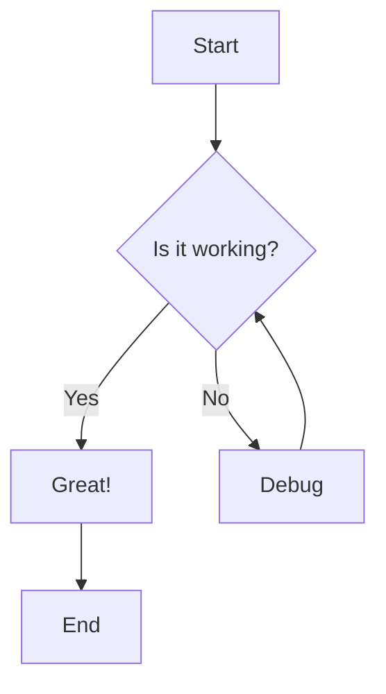
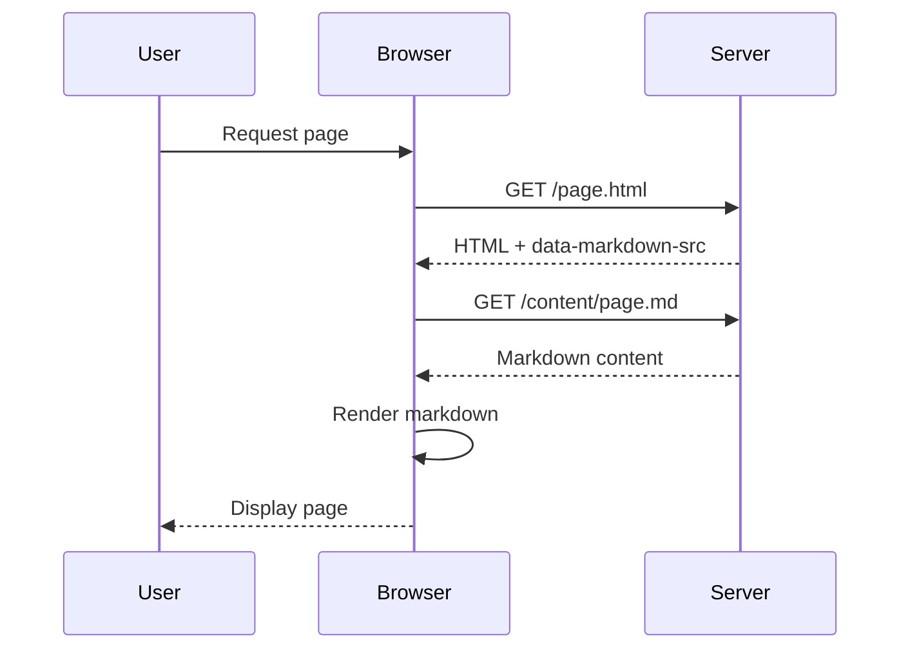

# Welcome to the Markdown Page Loader

This page demonstrates the full capabilities of the markdown rendering system.

[toc]

## Text Formatting

You can use **bold**, *italic*, ~~strikethrough~~, ==highlighted==, ++inserted++, and ~subscript~ or ^superscript^ text.

Here's an abbreviation: HTML

*[HTML]: Hyper Text Markup Language

## Lists

### Unordered List

- First item
- Second item
  - Nested item
  - Another nested item
- Third item

### Ordered List

1. Step one
2. Step two
3. Step three

### Task List

- [x] Complete task
- [x] Another complete task
- [ ] Incomplete task
- [ ] Another incomplete task

### Definition List

Term 1
: Definition for term 1

Term 2
: Definition for term 2
: Additional definition for term 2

## Code Blocks

Inline code: `const greeting = "Hello, World!";`

### JavaScript Example

```javascript
function greet(name) {
  console.log(`Hello, ${name}!`);
  return true;
}

greet('World');
```

### CSS Example

```css
.container {
  display: flex;
  justify-content: center;
  align-items: center;
  min-height: 100vh;
}
```

## Tables

| Feature | Status | Notes |
|---------|--------|-------|
| Markdown rendering | ✅ Complete | Full plugin support |
| Syntax highlighting | ✅ Complete | Via Prism.js |
| Sortable tables | ✅ Complete | Click headers to sort |
| Charts | ✅ Complete | Via Chart.js |
| Diagrams | ✅ Complete | Via Mermaid |

## Mathematics

Inline maths: $E = mc^2$

Block maths:

$$
\int_{-\infty}^{\infty} e^{-x^2} dx = \sqrt{\pi}
$$

The quadratic formula:

$$
x = \frac{-b \pm \sqrt{b^2 - 4ac}}{2a}
$$

## Diagrams

### Flowchart



### Sequence Diagram



## Charts

```chart
{
  "type": "bar",
  "data": {
    "labels": ["January", "February", "March", "April", "May"],
    "datasets": [{
      "label": "Monthly Sales (£)",
      "data": [12000, 19000, 15000, 25000, 22000],
      "backgroundColor": [
        "rgba(54, 162, 235, 0.8)",
        "rgba(75, 192, 192, 0.8)",
        "rgba(255, 206, 86, 0.8)",
        "rgba(255, 99, 132, 0.8)",
        "rgba(153, 102, 255, 0.8)"
      ]
    }]
  },
  "options": {
    "responsive": true,
    "plugins": {
      "title": {
        "display": true,
        "text": "Monthly Sales Performance"
      }
    }
  }
}
```

## Blockquotes

> "The best way to predict the future is to invent it."
> 
> — Alan Kay

## Containers

::: info
**Information**: This is an informational message that provides helpful context.
:::

::: warning
**Warning**: This highlights something important to be aware of.
:::

::: danger
**Danger**: This indicates a critical issue or potential problem.
:::

## Footnotes

Here's a sentence with a footnote[^1].

And another one[^2].

[^1]: This is the first footnote content.
[^2]: This is the second footnote content.

## Links and Images

Visit [Matthew's website](https://matthewdeeprose.github.io) for more.


## Tabs {.tabs}

### Tab One {.tab}

Content for the first tab goes here.

### Tab Two {.tab}

Content for the second tab appears when selected.

### Tab Three {.tab}

And here's the third tab content.

---

## Conclusion

This markdown page loader makes it easy to create content-rich pages using simple markdown files. All rendering happens client-side using the same powerful markdown-it pipeline as the main application.

**Features include:**

- Full markdown-it plugin support
- Syntax highlighting with Prism
- Mathematical notation with MathJax
- Interactive charts with Chart.js
- Diagrams with Mermaid
- Sortable tables
- Code copy buttons
- Accessibility compliant (WCAG 2.2 AA)
