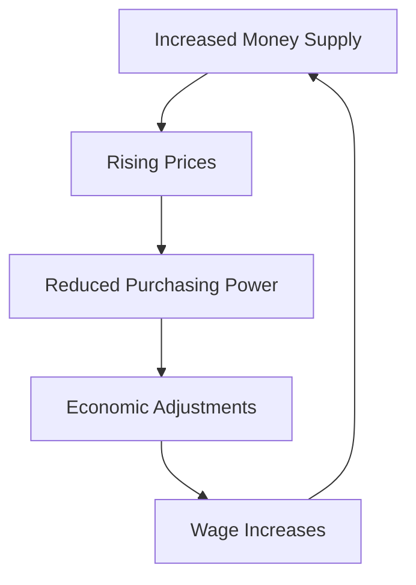

check footnotes

# Impact of Inflation on a Modern Economy

[[toc]]

## Overview

Inflation represents a critical economic phenomenon where the **purchasing power of currency declines** over time, affecting various aspects of economic activity.

### Inflation Mechanism Flow



### Economic Impact Data

```chart
{
  "type": "line",
  "data": {
    "labels": ["2018", "2019", "2020", "2021", "2022"],
    "datasets": [{
      "label": "Inflation Rate (%)",
      "data": [2.4, 1.8, 1.2, 4.7, 8.3],
      "tension": 0.4
    }]
  },
  "options": {
    "responsive": true,
    "plugins": {
      "title": {
        "display": true,
        "text": "Annual Inflation Trends"
      }
    }
  }
}
```

### Key Inflation Effects

| Economic Sector | Short-term Impact        | Long-term Impact        |
| --------------- | ------------------------ | ----------------------- |
| Consumers       | Reduced purchasing power | Wage pressure           |
| Businesses      | Increased input costs    | Price adjustments       |
| Investments     | Lower real returns       | Asset revaluation       |
| Government      | Increased debt burden    | Monetary policy changes |

::: info
**Key Insight:** Moderate inflation (2-3%) is generally considered healthy for economic growth.
:::

### Pie Distribution of Inflation Impact

```chart
{
  "type": "pie",
  "data": {
    "labels": ["Consumer Spending", "Business Costs", "Investment Returns", "Wage Dynamics"],
    "datasets": [{
      "label": "Inflation Impact Distribution",
      "data": [35, 25, 20, 20]
    }]
  },
  "options": {
    "responsive": true,
    "plugins": {
      "title": {
        "display": true,
        "text": "Sectoral Inflation Impact"
      }
    }
  }
}
```

## Conclusion

Inflation is a complex economic indicator that requires nuanced understanding and strategic management by policymakers, businesses, and individuals.

::: warning
**Caution:** High or unpredictable inflation can destabilise economic systems and erode financial security.
:::

Footnotes:

- \*[GDP]: Gross Domestic Product
- \*[CPI]: Consumer Price Index

[^1]: Economic data sourced from international monetary reports
[^2]: Trends may vary by regional economic conditions
