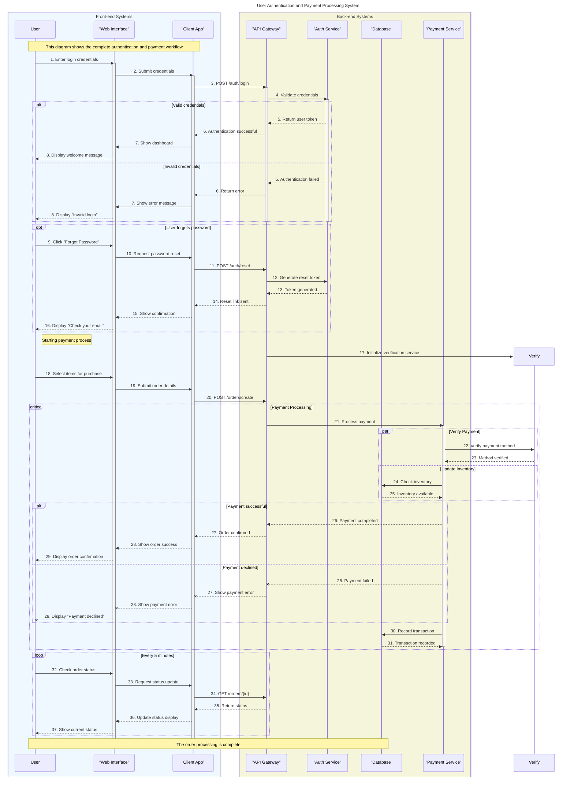

```mermaid
sequenceDiagram
    %% Title directive for the diagram
    title User Authentication and Payment Processing System

    %% Group for front-end components
    box rgb(240,248,255) Front-end Systems
        participant User as User
        participant UI as "Web Interface"
        participant Client as "Client App"
    end

    %% Group for back-end components
    box rgb(245,245,220) Back-end Systems
        participant API as "API Gateway"
        participant Auth as "Auth Service"
        participant DB as "Database"
        participant Payment as "Payment Service"
    end

    %% Initial note explaining the flow
    Note over User, Client: This diagram shows the complete authentication and payment workflow

    %% 1. Authentication Flow with Activation
    User->>UI: 1. Enter login credentials
    activate UI
    UI->>Client: 2. Submit credentials
    activate Client
    Client->>API: 3. POST /auth/login
    activate API
    API->>Auth: 4. Validate credentials
    activate Auth

    %% Alt block for authentication outcomes
    alt Valid credentials
        Auth-->>API: 5. Return user token
        API-->>Client: 6. Authentication successful
        Client-->>UI: 7. Show dashboard
        UI-->>User: 8. Display welcome message
    else Invalid credentials
        Auth-->>API: 5. Authentication failed
        API-->>Client: 6. Return error
        Client-->>UI: 7. Show error message
        UI-->>User: 8. Display "Invalid login"
    end

    deactivate Auth
    deactivate API

    %% Opt block for password reset (optional flow)
    opt User forgets password
        User->>UI: 9. Click "Forgot Password"
        UI->>Client: 10. Request password reset
        Client->>API: 11. POST /auth/reset
        API->>Auth: 12. Generate reset token
        Auth-->>API: 13. Token generated
        API-->>Client: 14. Reset link sent
        Client-->>UI: 15. Show confirmation
        UI-->>User: 16. Display "Check your email"
    end

    %% 2. Payment Flow with dynamic participant creation
    Note right of User: Starting payment process

    %% Proper participant creation - must have a message to it immediately after creation
    create participant Verify
    API->>Verify: 17. Initialize verification service

    User->>UI: 18. Select items for purchase
    UI->>Client: 19. Submit order details
    Client->>API: 20. POST /orders/create

    %% Critical block for payment processing
    critical Payment Processing
        API->>Payment: 21. Process payment
        activate Payment

        %% Use parallel block for concurrent operations
        par Verify Payment
            Payment->>Verify: 22. Verify payment method
            Verify-->>Payment: 23. Method verified
        and Update Inventory
            Payment->>DB: 24. Check inventory
            DB-->>Payment: 25. Inventory available
        end

        %% Alt block for payment outcomes
        alt Payment successful
            Payment-->>API: 26. Payment completed
            API-->>Client: 27. Order confirmed
            Client-->>UI: 28. Show order success
            UI-->>User: 29. Display order confirmation
        else Payment declined
            Payment--xAPI: 26. Payment failed
            API--xClient: 27. Show payment error
            Client--xUI: 28. Show payment error
            UI--xUser: 29. Display "Payment declined"
            %% Comment explaining the flow
            %% This would normally terminate the sequence in a break block
        end

        Payment->>DB: 30. Record transaction
        DB-->>Payment: 31. Transaction recorded
        deactivate Payment
    end

    %% Loop block for order tracking requests
    loop Every 5 minutes
        User->>UI: 32. Check order status
        UI->>Client: 33. Request status update
        Client->>API: 34. GET /orders/{id}
        API-->>Client: 35. Return status
        Client-->>UI: 36. Update status display
        UI-->>User: 37. Show current status
    end

    %% Destroy a service when no longer needed
    destroy Verify

    %% Final note
    Note over User, DB: The order processing is complete

    %% Deactivate remaining components
    deactivate Client
    deactivate UI
```
