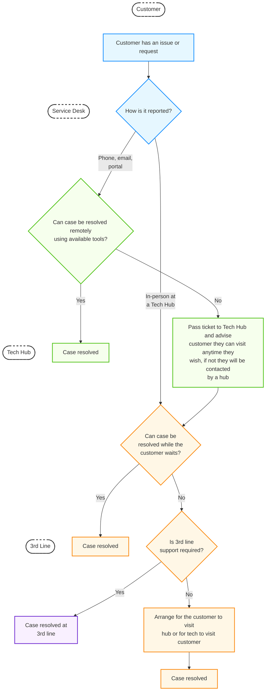
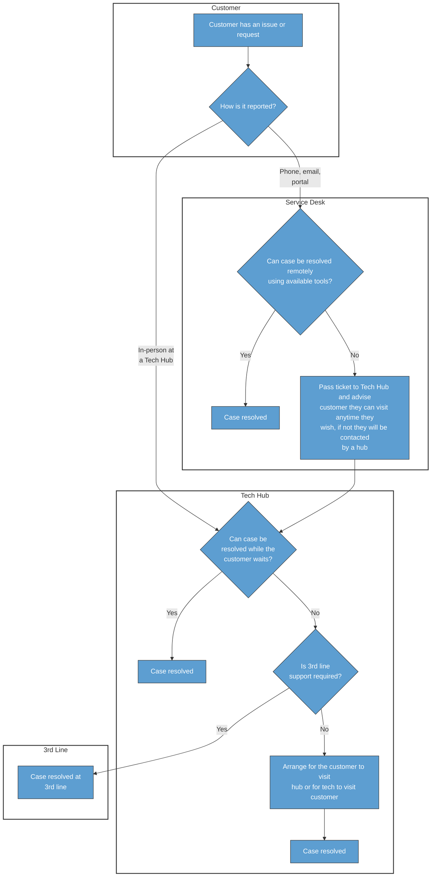

```mermaid
flowchart TD
    %% Define styles for each lane and type combination
    classDef customerProcess fill:#e6f7ff,stroke:#1890ff,stroke-width:2px,shape:rectangle
    classDef customerDecision fill:#e6f7ff,stroke:#1890ff,stroke-width:2px,shape:diamond
    classDef serviceDeskProcess fill:#f6ffed,stroke:#52c41a,stroke-width:2px,shape:rectangle
    classDef serviceDeskDecision fill:#f6ffed,stroke:#52c41a,stroke-width:2px,shape:diamond
    classDef techHubProcess fill:#fff7e6,stroke:#fa8c16,stroke-width:2px,shape:rectangle
    classDef techHubDecision fill:#fff7e6,stroke:#fa8c16,stroke-width:2px,shape:diamond
    classDef thirdLineProcess fill:#f9f0ff,stroke:#722ed1,stroke-width:2px,shape:rectangle
    classDef labelStyle fill:white,stroke:#333,stroke-width:2px,stroke-dasharray: 5 5

    %% Lane labels as distinct nodes
    CL([Customer]):::labelStyle
    SDL([Service Desk]):::labelStyle
    THL([Tech Hub]):::labelStyle
    TLL([3rd Line]):::labelStyle

    %% Invisible connections to create visual structure
    CL ~~~ A
    SDL ~~~ D
    THL ~~~ G
    TLL ~~~ L

    %% Customer Lane nodes
    A[Customer has an issue or request]:::customerProcess --> B{How is it reported?}:::customerDecision

    %% Service Desk Lane nodes
    B --> |Phone, email,<br>portal| D{Can case be resolved remotely<br>using available tools?}:::serviceDeskDecision
    D --> |Yes| E[Case resolved]:::serviceDeskProcess
    D --> |No| F[Pass ticket to Tech Hub and advise<br>customer they can visit anytime they<br>wish, if not they will be contacted<br>by a hub]:::serviceDeskProcess

    %% Tech Hub Lane nodes
    B --> |In-person at<br>a Tech Hub| G{Can case be<br>resolved while the<br>customer waits?}:::techHubDecision
    F --> G
    G --> |Yes| H[Case resolved]:::techHubProcess
    G --> |No| I{Is 3rd line<br>support required?}:::techHubDecision
    I --> |No| J[Arrange for the customer to visit<br>hub or for tech to visit customer]:::techHubProcess --> K[Case resolved]:::techHubProcess

    %% 3rd Line Lane nodes
    I --> |Yes| L[Case resolved at<br>3rd line]:::thirdLineProcess
```

```mermaid
flowchart TD
    %% Define styles to match the blue colours in the original
    classDef default fill:#f9f9f9,stroke:#333,stroke-width:1px;
    classDef decision fill:#5d9ed1,stroke:#333,stroke-width:1px,color:white,shape:diamond;
    classDef process fill:#5d9ed1,stroke:#333,stroke-width:1px,color:white,shape:stadium;
    classDef lane fill:none,stroke:#333,stroke-width:2px;

    %% Customer Lane
    subgraph Customer ["Customer"]
        A[Customer has an issue or request]:::process --> B{How is it reported?}:::decision
    end

    %% Service Desk Lane
    subgraph ServiceDesk ["Service Desk"]
        D{Can case be resolved remotely<br>using available tools?}:::decision --> |Yes| E[Case resolved]:::process
        D --> |No| F[Pass ticket to Tech Hub and advise<br>customer they can visit anytime they<br>wish, if not they will be contacted<br>by a hub]:::process
    end

    %% Tech Hub Lane
    subgraph TechHub ["Tech Hub"]
        G{Can case be<br>resolved while the<br>customer waits?}:::decision --> |Yes| H[Case resolved]:::process
        G --> |No| I{Is 3rd line<br>support required?}:::decision
        I --> |No| J[Arrange for the customer to visit<br>hub or for tech to visit customer]:::process --> K[Case resolved]:::process
    end

    %% 3rd Line Lane
    subgraph ThirdLine ["3rd Line"]
        L[Case resolved at<br>3rd line]:::process
    end

    %% Connections between lanes
    B --> |In-person at<br>a Tech Hub| G
    B --> |Phone, email,<br>portal| D
    F --> G
    I --> |Yes| L

    %% Apply styles to the swim lanes
    class Customer,ServiceDesk,TechHub,ThirdLine lane;
```
