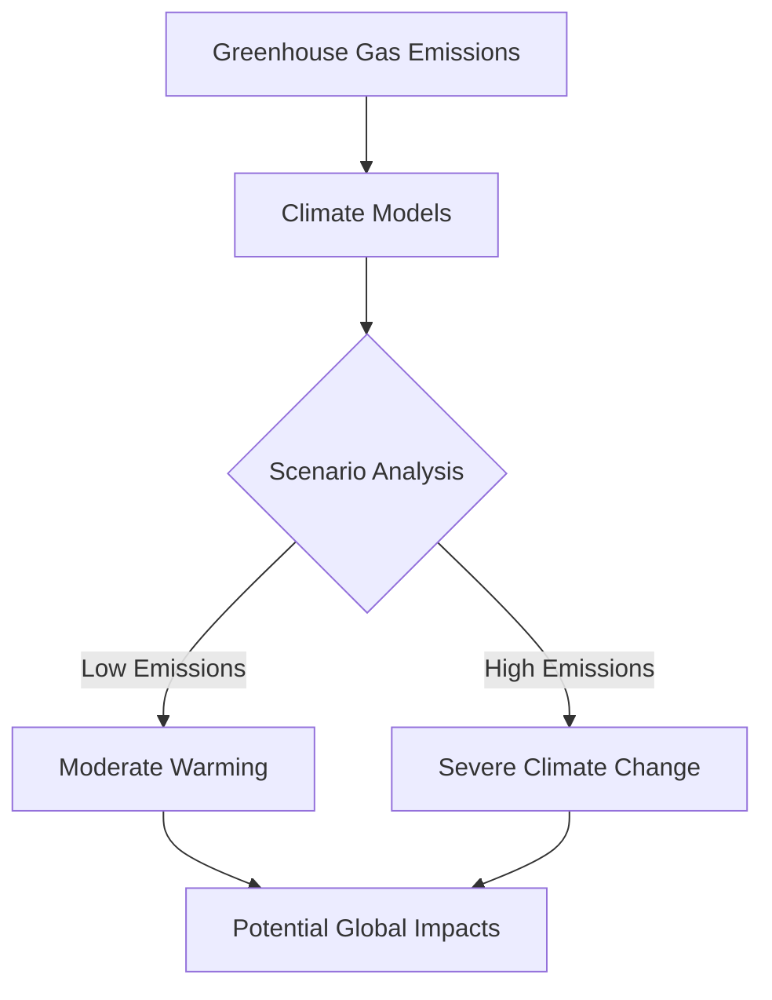

# Global Warming: A Comprehensive Overview

[[toc]]

## What is Global Warming?

Global warming is the long-term heating of Earth's climate system due to human activities, primarily through the increased emission of greenhouse gases. :earth_fire: The phenomenon has significant implications for our planet's ecosystem, weather patterns, and future sustainability.

## Key Causes

### Greenhouse Gas Emissions

:factory: Primary sources of greenhouse gases include:

- Fossil fuel combustion
- Industrial processes
- Deforestation
- Agricultural practices

### Carbon Dioxide Concentration

```chart
{
  "type": "line",
  "data": {
    "labels": ["1900", "1950", "2000", "2020", "2050 (Projected)"],
    "datasets": [{
      "label": "Atmospheric CO₂ Levels (ppm)",
      "data": [296, 311, 369, 412, 550]
    }]
  }
}
```

## Environmental Impacts

### Temperature Increase

- **Global average temperature rise:** Approximately 1.1°C since pre-industrial times
- Projected increase of 1.5-4.5°C by 2100

### Consequences

1. **Polar Ice Melt**
2. **Sea Level Rise**
3. **Extreme Weather Events**
4. **Ecosystem Disruption**

## Scientific Evidence

::: info
**Key Indicators:**

- Rising global temperatures
- Ocean acidification
- Shrinking ice sheets
- Increased frequency of extreme weather events
  :::

### Climate Model Projections



## Mitigation Strategies

### Renewable Energy

| Energy Type | CO₂ Reduction Potential | Global Adoption |
| ----------- | ----------------------- | --------------- |
| Solar       | High                    | Increasing      |
| Wind        | High                    | Expanding       |
| Hydro       | Moderate                | Established     |
| Nuclear     | High                    | Controversial   |

### Individual Actions

- [x] Reduce energy consumption
- [ ] Use public transportation
- [x] Adopt plant-based diet
- [ ] Support renewable energy initiatives

## Mathematical Perspective

The greenhouse effect can be simplified mathematically:

$Q_{net} = Q_{solar} - (Q_{reflected} + Q_{emitted})$

Where:

- $Q_{net}$ is net heat absorption
- $Q_{solar}$ is incoming solar radiation
- $Q_{reflected}$ is reflected solar radiation
- $Q_{emitted}$ is terrestrial radiation

## Global Efforts

::: warning
**Critical Challenges:**

- Coordinating international climate policies
- Balancing economic development with environmental protection
- Transitioning to sustainable technologies
  :::

### International Agreements

- Paris Agreement (2015)
- Kyoto Protocol
- Glasgow Climate Pact

## Future Outlook

**Potential Scenarios:**

1. **Optimistic:** Rapid technological innovation and global cooperation
2. **Moderate:** Gradual emissions reduction
3. **Pessimistic:** Continued high-emission trajectory

:bulb: **Key Takeaway:** Immediate and collective action is crucial to mitigate global warming's most severe consequences.

## Additional Resources

- [IPCC Reports](https://www.ipcc.ch/)
- _[NASA Climate Change Resources](https://climate.nasa.gov/)_
- Intergovernmental Panel on Climate Change

_[CO₂]: Carbon Dioxide
_[IPCC]: Intergovernmental Panel on Climate Change

## Footnotes

Global warming represents one of the most significant challenges of the 21st century, requiring unprecedented global cooperation and innovative solutions.[^1]

[^1]: IPCC Special Report on Global Warming, 2018
