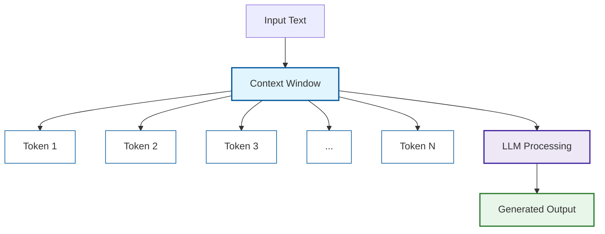
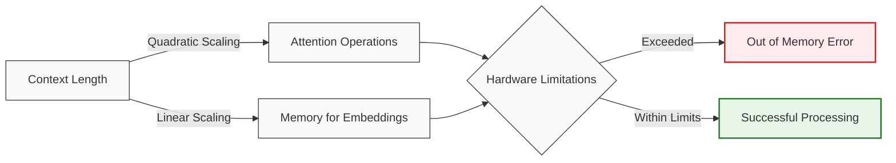
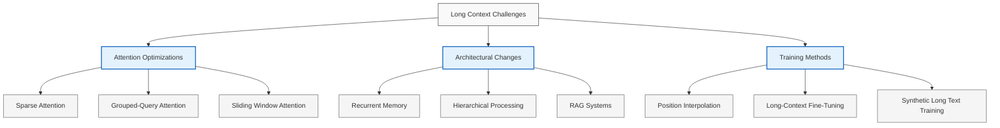
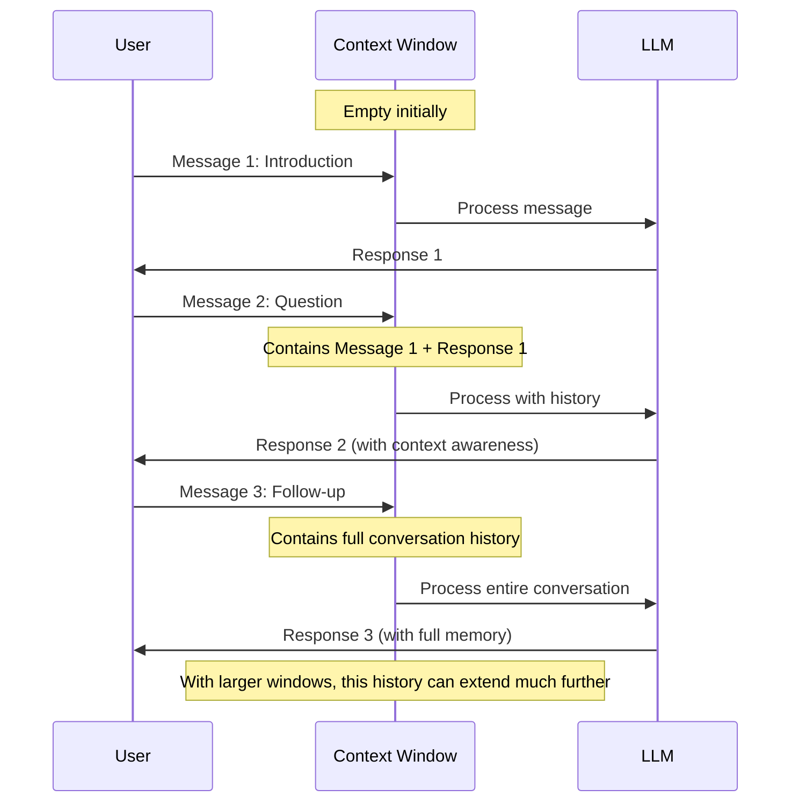
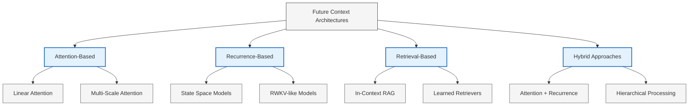

# Understanding LLM Context Windows

Large Language Models (LLMs) like GPT-4, Claude, and LLaMA process text using a "context window" - the amount of text they can consider at once. Let's explore this concept in depth.

## What is a Context Window?

::: tabs#context-basics
@tab:active Definition
A **context window** is the maximum amount of text (tokens) that an LLM can process in a single interaction. It represents the model's "working memory" and affects how much information the model can reference when generating a response.

Key characteristics include:
- Measured in tokens (word fragments)
- Varies by model and version
- Sets a hard limit on input + output text

@tab Tokens Explained
Tokens are the basic units that LLMs process text in. They don't correspond directly to words or characters but can be thought of as word fragments:

| Example Text | Token Count | Explanation |
|-------------|-------------|-------------|
| "Hello world" | 2 tokens | Common words are single tokens |
| "Antidisestablishmentarianism" | 5 tokens | Long words split into multiple tokens |
| "你好世界" | 2-4 tokens | Non-English can use more tokens |
| "1234567890" | 2-3 tokens | Numbers typically split into multiple tokens |

```bash
# Example of tokenization of a sentence
"The quick brown fox jumps over the lazy dog"
# Splits into approximately 9 tokens
["The", " quick", " brown", " fox", " jumps", " over", " the", " lazy", " dog"]
```

@tab Visual Representation

Here's how we can visualize a context window:


:::

## Context Window Sizes by Model

Different LLMs have different context window capabilities:

::: tabs#context-sizes
@tab As of March 2025
| Model | Context Window Size | Released | Notes |
|-------|---------------------|----------|-------|
| GPT-4o | 128K tokens | March 2024 | Approximately 350-400 pages |
| Claude 3 Opus | 200K tokens | March 2024 | Longest commercially available |
| Gemini 1.5 Pro | 1M tokens | February 2024 | Experimental; limited access |
| GPT-3.5 Turbo | 16K tokens | January 2023 | 45-50 pages of text |
| Claude 2 | 100K tokens | July 2023 | Early long-context model |

*Note: Token counts are approximate page equivalents (assuming ~350 words/page)*

@tab Historical Progression

<div class="chart-container">
```chart
{
  "type": "line",
  "data": {
    "labels": ["2020", "2021", "2022", "2023", "2024", "2025"],
    "datasets": [
      {
        "label": "GPT Models",
        "data": [2, 4, 8, 32, 128, 128],
        "borderColor": "rgb(75, 192, 192)",
        "tension": 0.1
      },
      {
        "label": "Claude Models",
        "data": [null, 2, 9, 100, 200, 200],
        "borderColor": "rgb(153, 102, 255)",
        "tension": 0.1
      },
      {
        "label": "Gemini/PaLM Models",
        "data": [null, null, 8, 32, 1000, 1000],
        "borderColor": "rgb(255, 99, 132)",
        "tension": 0.1
      }
    ]
  },
  "options": {
    "scales": {
      "y": {
        "title": {
          "display": true,
          "text": "Context Window (K tokens)"
        },
        "type": "logarithmic"
      },
      "x": {
        "title": {
          "display": true,
          "text": "Year"
        }
      }
    },
    "plugins": {
      "title": {
        "display": true,
        "text": "Growth of LLM Context Window Sizes"
      }
    }
  }
}
```
</div>

@tab Comparison Chart

<div class="chart-container">
```chart
{
  "type": "bar",
  "data": {
    "labels": ["GPT-3.5", "GPT-4o", "Claude 3 Opus", "Gemini 1.5 Pro", "LLaMA 3", "Mistral Large"],
    "datasets": [
      {
        "label": "Context Window Size (K tokens)",
        "data": [16, 128, 200, 1000, 128, 32],
        "backgroundColor": [
          "rgba(255, 99, 132, 0.5)",
          "rgba(54, 162, 235, 0.5)",
          "rgba(255, 206, 86, 0.5)",
          "rgba(75, 192, 192, 0.5)",
          "rgba(153, 102, 255, 0.5)",
          "rgba(255, 159, 64, 0.5)"
        ],
        "borderColor": [
          "rgb(255, 99, 132)",
          "rgb(54, 162, 235)",
          "rgb(255, 206, 86)",
          "rgb(75, 192, 192)",
          "rgb(153, 102, 255)",
          "rgb(255, 159, 64)"
        ],
        "borderWidth": 1
      }
    ]
  },
  "options": {
    "scales": {
      "y": {
        "beginAtZero": true,
        "title": {
          "display": true,
          "text": "Thousands of Tokens"
        },
        "type": "logarithmic"
      }
    },
    "plugins": {
      "title": {
        "display": true,
        "text": "Context Window Sizes of Major LLMs (2025)"
      }
    }
  }
}
```
</div>
:::

## Technical Challenges with Long Contexts

::: tabs#challenges
@tab Memory Constraints
**Memory Usage Challenges**

Processing large context windows requires significant computational resources:

1. **Attention Mechanism Scaling**:
   - Vanilla attention scales quadratically: $O(n^2)$ where $n$ is context length
   - 100K tokens requires 10 billion attention calculations

2. **GPU Memory Requirements**:
   - 32K context typically requires 60-100GB of VRAM
   - 1M context may require specialized hardware configurations



@tab Performance Degradation
**Degradation with Longer Contexts**

Research shows that model performance often degrades as context length increases:

| Context Length | Information Retrieval | Reasoning Performance | Generation Quality |
|----------------|----------------------|------------------------|-------------------|
| 2K tokens | 95% accuracy | High | Consistent |
| 8K tokens | 87% accuracy | Moderate | Mostly consistent |
| 32K tokens | 76% accuracy | Varies | May drift |
| 100K+ tokens | <60% accuracy | Poor for early context | Prone to hallucination |

The graph below shows the typical "attention decay" pattern:

<div class="chart-container">
```chart
{
  "type": "line",
  "data": {
    "labels": ["1K", "2K", "4K", "8K", "16K", "32K", "64K", "128K"],
    "datasets": [
      {
        "label": "Information Retrieval Accuracy",
        "data": [96, 95, 92, 87, 82, 76, 67, 58],
        "borderColor": "rgb(75, 192, 192)",
        "tension": 0.1,
        "fill": false
      },
      {
        "label": "Position of Information",
        "data": [
          {"x": "1K", "y": 95},
          {"x": "8K", "y": 90},
          {"x": "16K", "y": 85},
          {"x": "32K", "y": 78},
          {"x": "64K", "y": 62},
          {"x": "128K", "y": 45}
        ],
        "borderColor": "rgb(255, 99, 132)",
        "tension": 0.1,
        "fill": false,
        "borderDash": [5, 5]
      }
    ]
  },
  "options": {
    "scales": {
      "y": {
        "title": {
          "display": true,
          "text": "Accuracy (%)"
        },
        "min": 40,
        "max": 100
      },
      "x": {
        "title": {
          "display": true,
          "text": "Context Length (tokens)"
        }
      }
    }
  }
}
```
</div>

@tab Technical Solutions
**Approaches to Improving Long-Context Performance**

Several techniques have emerged to address long context challenges:

1. **Attention Optimizations**:
   - **Sparse Attention**: Only attend to important tokens
   - **Grouped-Query Attention (GQA)**: Used in Claude models
   - **Multi-Query Attention (MQA)**: Reduces memory footprint

2. **Architectural Innovations**:
   - **Recurrent Memory**: Maintain state across context chunks
   - **Retrieval-Augmented Generation (RAG)**: Query external knowledge

3. **Training Approaches**:
   - **Position Interpolation**: Train on shorter contexts, extrapolate to longer
   - **Long-Context Fine-Tuning**: Additional training on long documents


:::

## Practical Applications

::: tabs#applications
@tab Document Analysis
**Document Analysis & Understanding**

Long context windows enable comprehensive analysis of entire documents:

- **Legal contract review** - Analyze entire agreements (50+ pages)
- **Academic paper summarization** - Process full research papers with references
- **Technical documentation** - Understand complex systems documentation

> 📑 **Example Use Case**: A legal firm uses Claude 3 Opus to review 200-page merger agreements, identifying potential risks and inconsistencies across the entire document without needing to split it into chunks.

@tab Conversational Memory
**Extended Conversational Memory**

Longer context allows for more natural, human-like conversations:

- Remembering details from earlier in the conversation
- Building on previously established ideas
- Learning user preferences through extended interaction

This capability is particularly useful for:
- Customer support systems
- Educational tutoring
- Therapeutic applications
- Creative collaboration

The diagram below shows how conversational memory works:



@tab Creative Writing
**Creative Writing & Analysis**

Extended context enables sophisticated literary applications:

- **Book analysis**: Process entire novels (100K+ words)
- **Script development**: Maintain consistency across screenplay
- **Content creation**: Generate long-form articles with consistent tone and structure

**Poetry Example**:

> *Roses are red*  
> *Violets are blue*  
> *Context windows grow*  
> *And memories do too*

Extended context allows an LLM to maintain rhyme scheme, meter, themes, and narrative threads across much longer creative works than was previously possible.

@tab Code Understanding
**Code Understanding & Generation**

Long context windows revolutionize coding assistance:

- **Multiple file analysis**: Understand relationships between different source files
- **Large codebase comprehension**: Grasp complex projects with many dependencies
- **Framework-aware assistance**: Maintain awareness of imported libraries and frameworks

```python
# Example of a complex function an LLM could now understand in context
def process_large_dataset(filename, columns=None, transform_funcs=None, 
                         filters=None, batch_size=1000, output_format='csv'):
    """
    Process a large dataset with various transformations and filters.
    
    Args:
        filename (str): Path to the input file
        columns (list): Columns to keep (None = all)
        transform_funcs (dict): Dictionary mapping column names to transform functions
        filters (list): List of filter functions to apply to rows
        batch_size (int): Size of batches for processing
        output_format (str): Output format ('csv', 'json', etc.)
        
    Returns:
        str: Path to the processed output file
    """
    # Complex implementation with many dependencies
    # that spans dozens of lines of code...
    
    return output_path
```

With long context, the LLM can see this function definition alongside:
- Multiple other functions it calls
- Class definitions it references
- Import statements
- Documentation strings
- Usage examples
:::

## Best Practices

### Optimizing Content for Long Context Windows

::: tabs#best-practices
@tab Organization Techniques
**Content Organization for Maximum Benefit**

1. **Front-load important information**
   - Put critical details at the beginning
   - Include clear instructions first

2. **Use clear hierarchical structure**
   - Section headings and subheadings
   - Numbered lists for sequential instructions
   - Bullet points for key information

3. **Include explicit markers**
   ```
   [START OF DOCUMENT]
   ...content...
   [END OF DOCUMENT]
   ```

@tab Prompt Strategies
**Effective Prompting for Long Contexts**

1. **Explicit retrieval prompts**
   - "Based on the text in section 3, paragraph 2..."
   - "Refer to the data table on page 7..."

2. **Use delimiter templates**
   ```
   User: <query>
   
   Document: <full document text>
   
   Task: Answer the user's query using only information from the document.
   ```

3. **Two-stage prompting**
   - First prompt: "Identify all relevant sections about X"
   - Second prompt: "Now analyze these sections in detail..."

@tab Testing Methods

**Verifying Long-Context Capabilities**

Test your LLM's long-context performance with these methods:

1. **Needle-in-haystack tests**
   - Place specific information deep in the context
   - Query about that specific information
   - Example: "What was the middle name mentioned in paragraph 47?"

2. **Context window limit testing**
   ```
   START
   [... thousands of tokens of random text ...]
   SECRET_KEY: BLUE_ELEPHANT_42
   [... thousands more tokens of text ...]
   END
   
   What is the SECRET_KEY in the above text?
   ```

3. **Consistency checking**
   - Present contradictory information in different parts of the context
   - Check which information the model prioritizes
   - Example: "In the beginning of the document I'm 35, but later I mention being 42. How old am I?"

@tab Handling Limitations
**Working Around Limitations**

Even with large context windows, some limitations remain:

1. **Chunking strategies**
   - Overlap consecutive chunks by 10-20%
   - Maintain summary of previous chunks
   - Use semantic chunking (by topic) rather than arbitrary splits

2. **Hybrid retrieval approaches**
   - Vector database for initial retrieval
   - Full-context processing for final answer
   - Example: RAG (Retrieval-Augmented Generation)

3. **Hierarchical summarization**
   For extremely long documents:
   ```mermaid
   graph TD
       A[Full Document] --> B[Chunk 1]
       A --> C[Chunk 2]
       A --> D[...]
       A --> E[Chunk N]
       B --> F[Summary 1]
       C --> G[Summary 2]
       D --> H[...]
       E --> I[Summary N]
       F --> J[Meta-Summary]
       G --> J
       H --> J
       I --> J
       J --> K[Final Response]
       
       classDef chunk fill:#e1f5fe,stroke:#01579b,stroke-width:1px;
       classDef summary fill:#e8f5e9,stroke:#1b5e20,stroke-width:1px;
       classDef meta fill:#f3e5f5,stroke:#4a148c,stroke-width:1px;
       
       class B,C,D,E chunk;
       class F,G,H,I summary;
       class J meta;
   ```
:::

## Future Developments

The evolution of context windows continues to advance rapidly. Here are some emerging trends:

::: tabs#future
@tab Theoretical Limits
**Theoretical Limitations & Possibilities**

The question of "how long can context windows get?" involves several considerations:

1. **Computational Complexity**
   - Standard attention: $O(n^2)$ scaling
   - Linear attention variants: $O(n)$ scaling
   - Current practical limits around 1M tokens

2. **Hardware Constraints**
   - Memory bandwidth limitations
   - GPU VRAM capacities
   - Specialized AI accelerators

3. **Training Data Requirements**
   - Need for long-document training data
   - Synthetic data generation

<div class="chart-container">
```chart
{
  "type": "scatter",
  "data": {
    "datasets": [
      {
        "label": "Theoretical Limits by Approach",
        "data": [
          {"x": 2023, "y": 100000},
          {"x": 2024, "y": 1000000},
          {"x": 2025, "y": 5000000},
          {"x": 2026, "y": 10000000},
          {"x": 2027, "y": 50000000}
        ],
        "backgroundColor": "rgba(75, 192, 192, 0.5)",
        "borderColor": "rgb(75, 192, 192)"
      },
      {
        "label": "Commercial Models",
        "data": [
          {"x": 2023, "y": 32000},
          {"x": 2024, "y": 200000},
          {"x": 2025, "y": 1000000}
        ],
        "backgroundColor": "rgba(255, 99, 132, 0.5)",
        "borderColor": "rgb(255, 99, 132)"
      }
    ]
  },
  "options": {
    "scales": {
      "y": {
        "type": "logarithmic",
        "title": {
          "display": true,
          "text": "Context Length (tokens)"
        }
      },
      "x": {
        "title": {
          "display": true,
          "text": "Year"
        }
      }
    },
    "plugins": {
      "title": {
        "display": true,
        "text": "Projected Context Window Growth"
      }
    }
  }
}
```
</div>

@tab Novel Architectures
**Emerging Architectural Approaches**

New model architectures aim to overcome traditional attention limitations:

1. **Recurrent Models**
   - Recurrent update of a fixed-size state
   - Infinite theoretical context length
   - Examples: RWKV, Mamba, RetNet

2. **Hybrid Approaches**
   - Combining attention with recurrence
   - Sparse retrieval + dense processing
   - Structured state representations

3. **Retrieval-Enhanced Models**
   - Built-in retrieval capabilities
   - Dynamic knowledge access
   - "Infinite" context through external memory



@tab Practical Advances
**Practical Capabilities on the Horizon**

Long context enables new practical applications:

1. **Document-scale understanding**
   - Process entire books at once
   - Full academic paper analysis
   - Complete codebase understanding

2. **Long-term memory**
   - Persistent agent memory across sessions
   - Personalized long-term assistants
   - Historical conversation recall

3. **Multi-document synthesis**
   - Analyze and synthesize multiple source documents
   - Compare contradicting sources
   - Research assistant capabilities

> 💡 **Future Use Case**: An AI research assistant that can read your entire publication history, compare it with the latest papers in your field, and suggest novel research directions that build on your expertise while addressing emerging trends.

@tab Ethical Considerations
**Ethical Implications of Expanding Context**

Longer context windows introduce new ethical considerations:

1. **Privacy risks**
   - More personal data in context
   - Potential for unintended data exposure
   - Need for robust data handling policies

2. **Legal concerns**
   - Copyright implications of full-document processing
   - Intellectual property protection
   - Regulatory compliance challenges

3. **Accessibility and fairness**
   - Computational requirements limit access
   - Technical knowledge barriers
   - Energy consumption and environmental impact

4. **Responsibility frameworks**
   - Content moderation at scale
   - Attribution and sourcing
   - Transparency in processing

**Suggested Guidelines**:

| Concern | Recommendation |
|---------|----------------|
| Privacy | Implement clear data retention policies |
| Legal use | Develop frameworks for fair use in AI processing |
| Accessibility | Create tiered services with essential capabilities for all |
| Environmental | Optimize for computational efficiency |
| Transparency | Provide processing logs and attribution |
:::

## Conclusion

The expansion of context windows represents one of the most significant advances in LLM capability. While algorithmic challenges remain, the trends point toward continued growth in context length and more sophisticated handling of long-form content.

For developers and users, understanding both the capabilities and limitations of context windows is essential for effectively leveraging these powerful AI systems.

---

### References and Further Reading

1. Attention Is All You Need (Vaswani et al., 2017)
2. Position Interpolation for Large Language Models (OpenAI, 2023)
3. Lost in the Middle: How Language Models Use Long Contexts (Liu et al., 2023)
4. Scaling Transformer to 1M tokens and beyond with RMT (Fu et al., 2023)
5. State Space Models as Foundation Models (Gu & Dao, 2023)

*This document was created as a test page demonstrating various markdown features including tabs, charts, diagrams, and tables.*