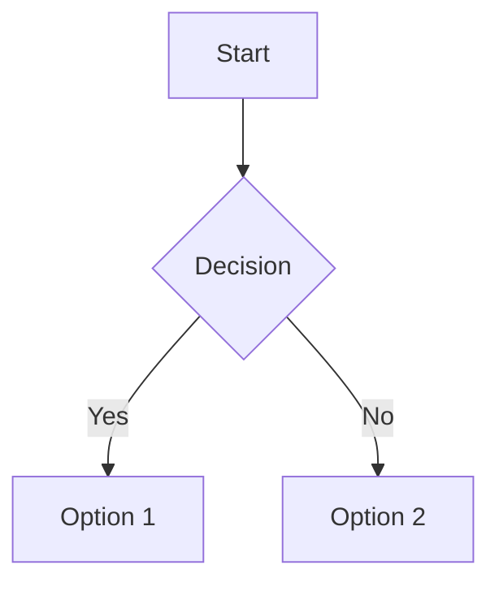

## Basic Markdown Features to Test

[[toc]]


1. **Headings**: Type different heading levels (# for h1, ## for h2, etc.) to ensure they render properly.

2. **Text formatting**: Test *italic*, **bold**, and ***bold italic*** formatting.

3. **Lists**: Try both ordered (1. 2. 3.) and unordered (- or *) lists, including nested lists.

4. **Links**: Create [text links](https://example.com) to verify they work properly.

5. **Images**: Insert an image with  syntax.

## Testing Plugin-Specific Features

### 1. Math Expressions (MathJax)
The sample already includes several math expressions. Click "Render Markdown" to verify:
- Inline math with single `$`: $a^2 + b^2 = c^2$
- Block math with double `$$`: $$\int_{a}^{b} f(x) \, dx$$


### 2. Code Highlighting (Prism)
Test code blocks with language specification:
```javascript
function testFunction() {
    return "This should be highlighted";
}
```

### 3. Markdown-it Plugins
Test each of the loaded plugins:

- **Subscript**: H~2~O should render with the 2 as subscript.
- **Superscript**: E=mc^2^ should render with the 2 as superscript.
- **Footnotes**: Here is a footnote reference[^1].
  [^1]: This is the footnote content.

- **Definition Lists**:

  Term 1
  : Definition 1
  
  Term 2
  : Definition 2

- **Abbreviations**:
  *[HTML]: Hypertext Markup Language
  This HTML should have a tooltip.

- **Emoji**: :smile: :thumbsup: should convert to emoji.

- **Insertions**: ++inserted text++ should be underlined.

- **Mark**: ==highlighted text== should have a background.

- **Task Lists**: 
  - [ ] Unchecked task
  - [x] Checked task

- **Containers**:
  ::: info
  This is an info box.
  :::

  ::: warning
  This is a warning box.
  :::

  ::: danger
  This is a danger box.
  :::

### 4. Table of Contents


### 5. Tables (multimd-table)

| Header 1 | Header 2 |
|----------|----------|
| Cell 1   | Cell 2   |
| Cell 3   | Cell 4   |


### 6. Attributes
Try adding attributes to elements:
{.red .bold}

### 7. Figures
Test implicit figures:


### 9. Mermaid Diagrams


### 10. Charts
```chart
{
  "type": "bar",
  "data": {
    "labels": ["January", "February", "March"],
    "datasets": [
      {
        "label": "Sample Data",
        "data": [65, 59, 80]
      }
    ]
  }
}
```

