# Mermaid Diagram Test Collection

This collection contains various Mermaid diagrams to test your implementation, ranging from simple to complex and covering different diagram types. Some diagrams support orientation changes, while others demonstrate specific Mermaid features.

## Table of Contents

1. [Basic Flowchart](#basic-flowchart)
2. [Complex Flowchart](#complex-flowchart)
3. [State Diagram](#state-diagram)
4. [Class Diagram](#class-diagram)
5. [Entity Relationship Diagram](#entity-relationship-diagram)
6. [Sequence Diagram](#sequence-diagram)
7. [Gantt Chart](#gantt-chart)
8. [Pie Chart](#pie-chart)
9. [User Journey](#user-journey)
10. [Git Graph](#git-graph)
11. [Mindmap](#mindmap)
12. [Timeline](#timeline)
13. [Quadrant](#quadrant)
14. [Requirement](#Requirement)

## Basic Flowchart

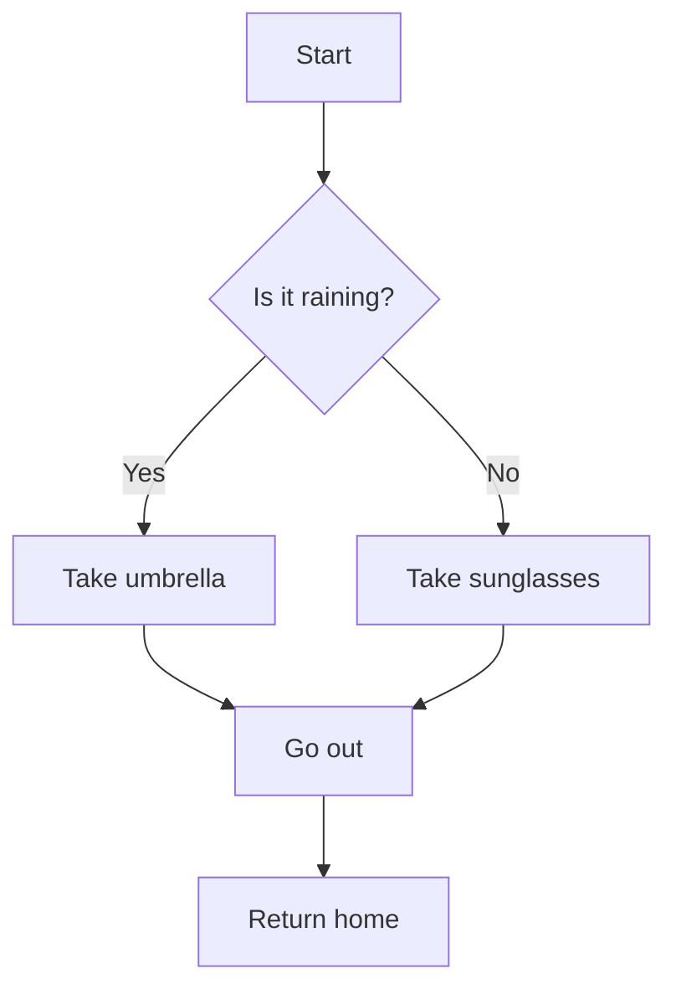

## Complex Flowchart

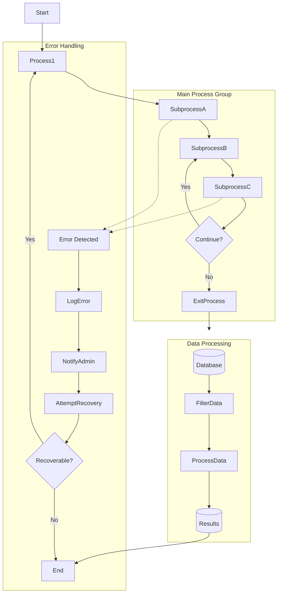

## State Diagram

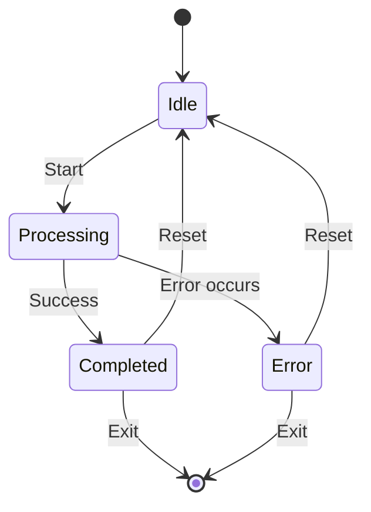

## Class Diagram

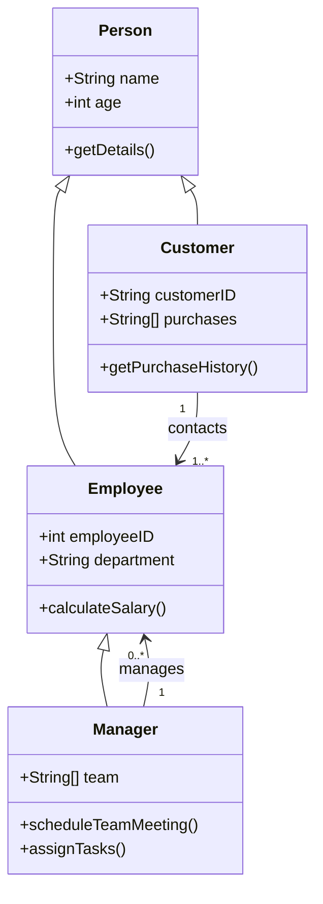

## Entity Relationship Diagram

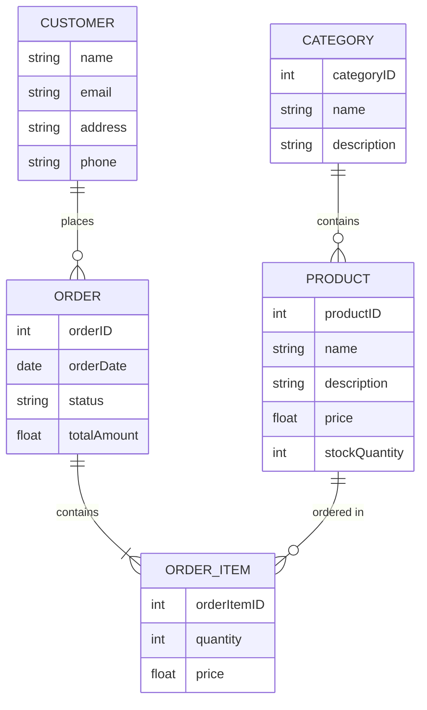

## Sequence Diagram

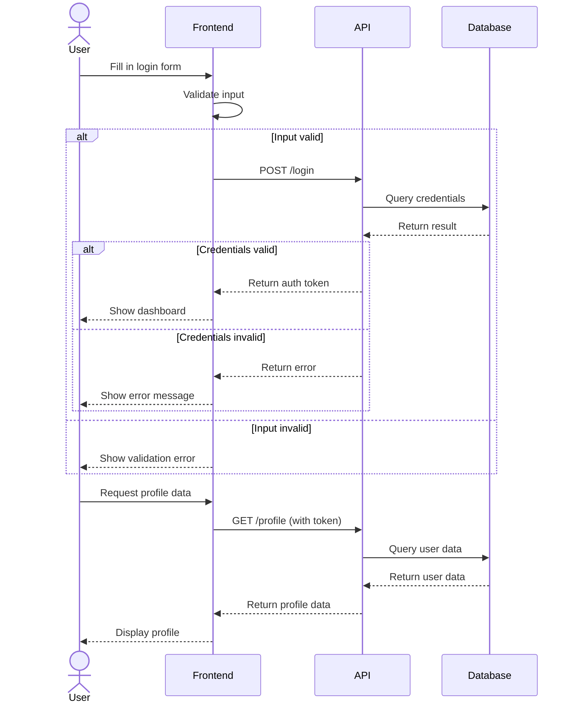

## Gantt Chart

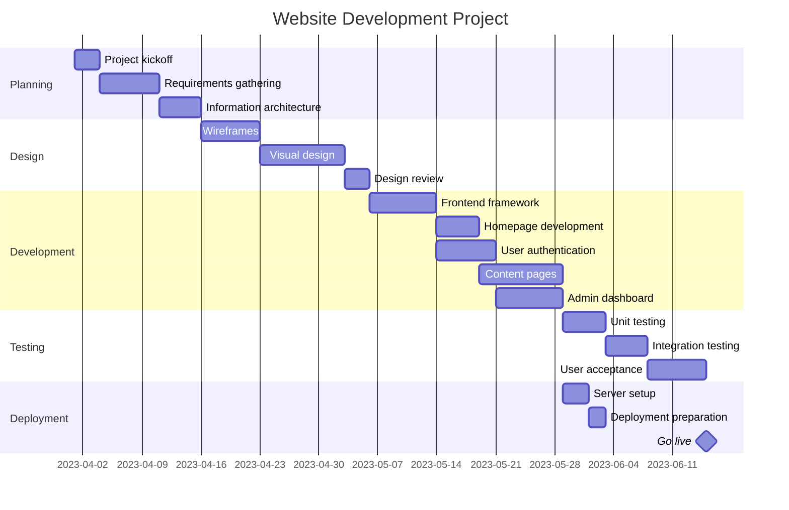

## Pie Chart

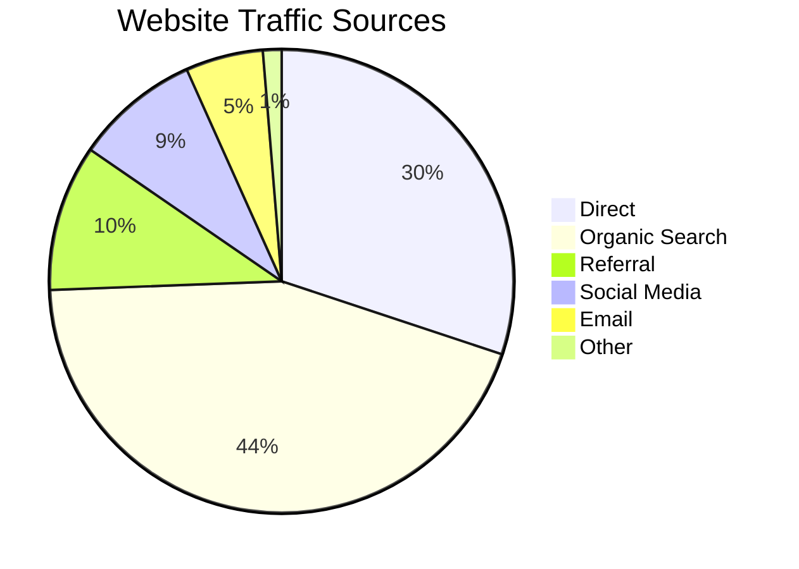

## User Journey

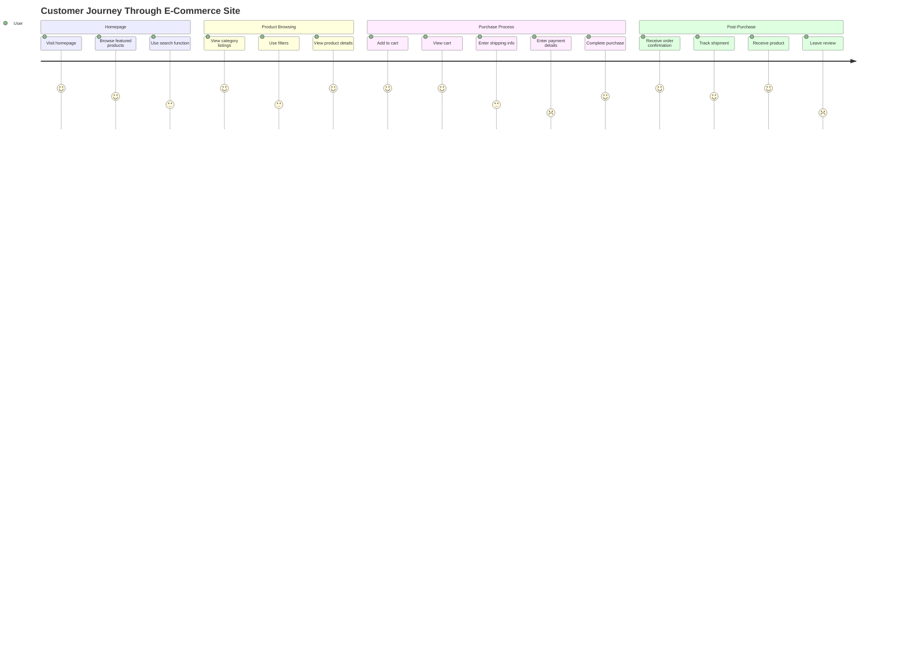

## Git Graph

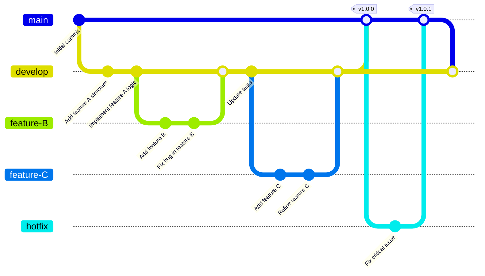

## Mindmap

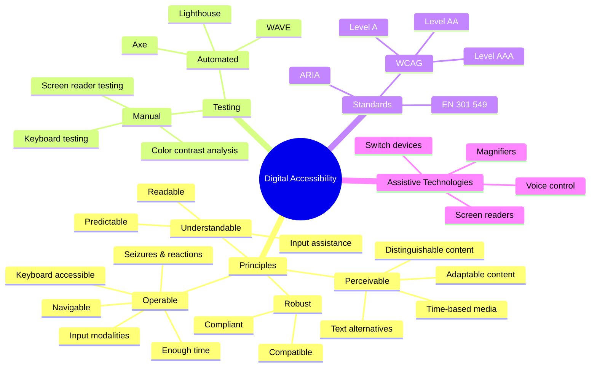

## Timeline

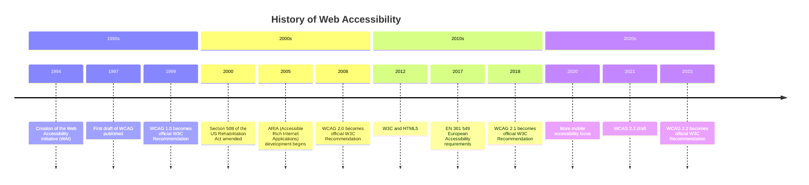

## Accessibility Compliance Flowchart

```mermaid
flowchart LR
    Start([Start Assessment]) --> Audit[Conduct Accessibility Audit]
    Audit --> Issues{Issues Found?}
    Issues -->|No| Compliance[Verify WCAG 2.2 AA Compliance]
    Issues -->|Yes| Priority[Prioritize Issues]
    Priority --> Critical{Critical Issues?}
    Critical -->|Yes| FixCritical[Fix Critical Issues]
    Critical -->|No| Plan[Create Remediation Plan]
    FixCritical --> Plan
    Plan --> Implementation[Implement Fixes]
    Implementation --> Testing[Test with Assistive Technologies]
    Testing --> Validation{All Fixed?}
    Validation -->|No| Implementation
    Validation -->|Yes| Documentation[Document Conformance]
    Documentation --> Training[Train Content Creators]
    Training --> Monitoring[Establish Monitoring Process]
    Compliance --> Documentation
    Monitoring --> End([End Assessment])
```

## Quadrant

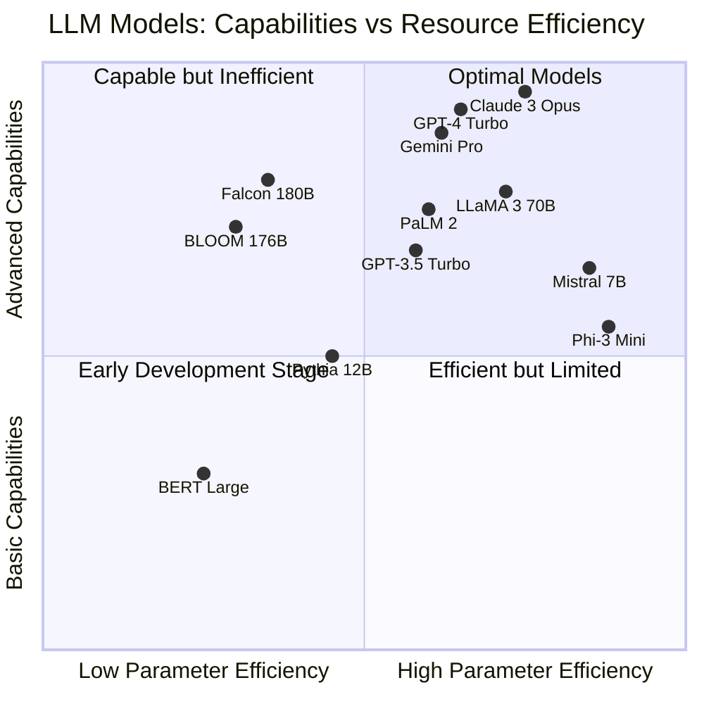

## Requirement

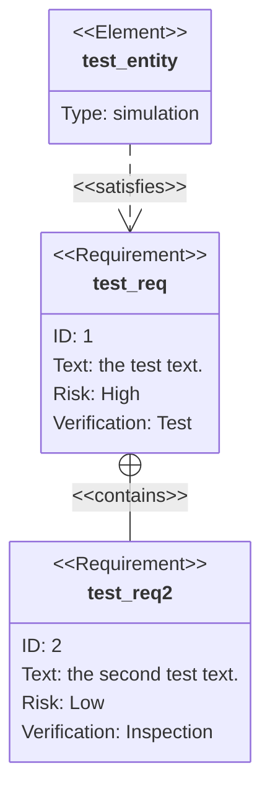
