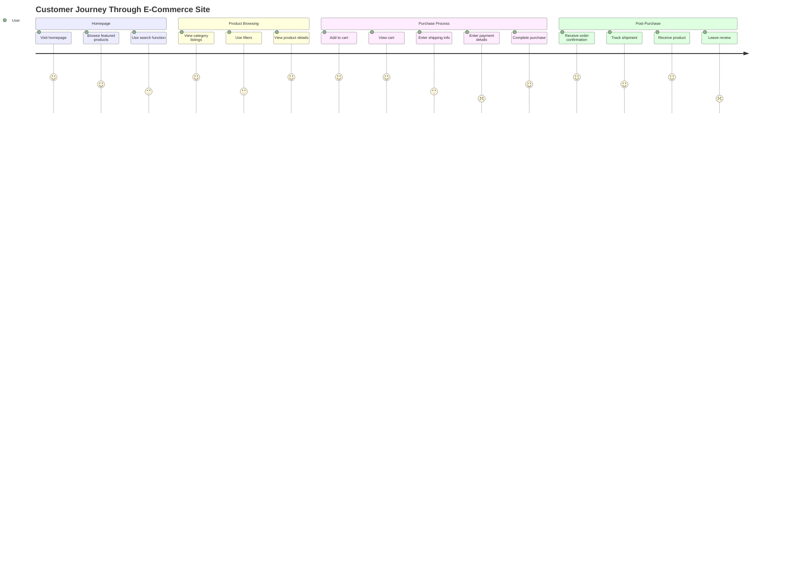
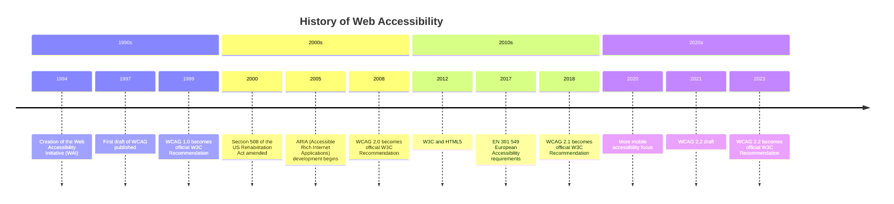
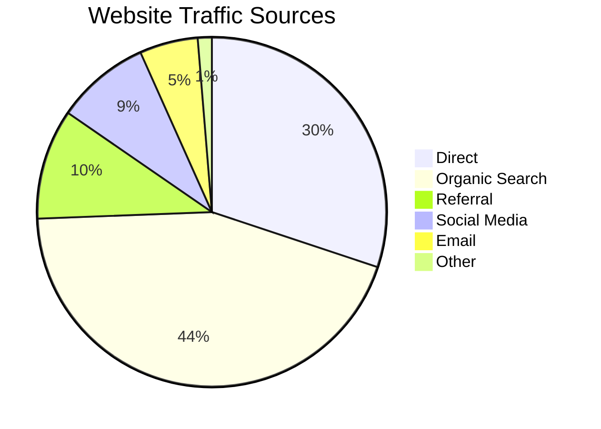
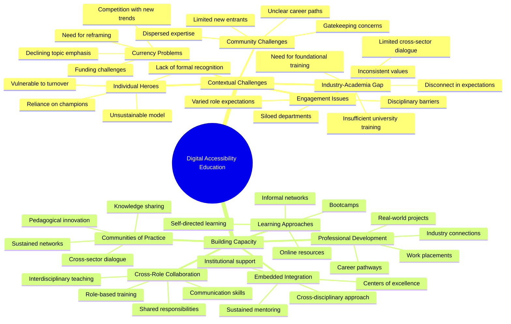
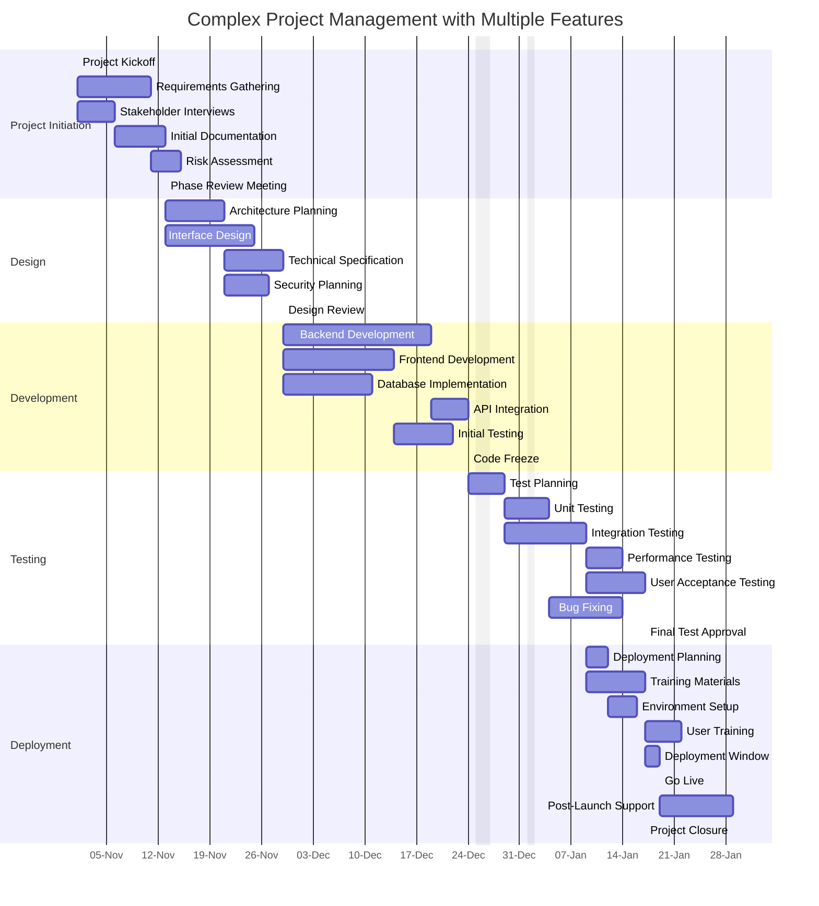
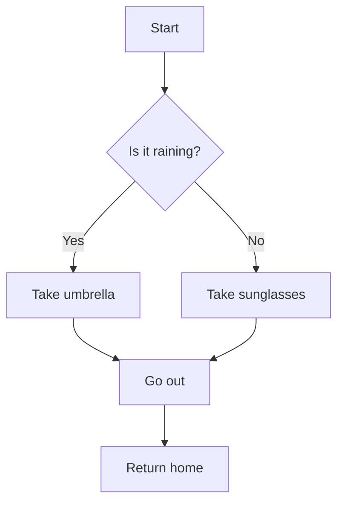
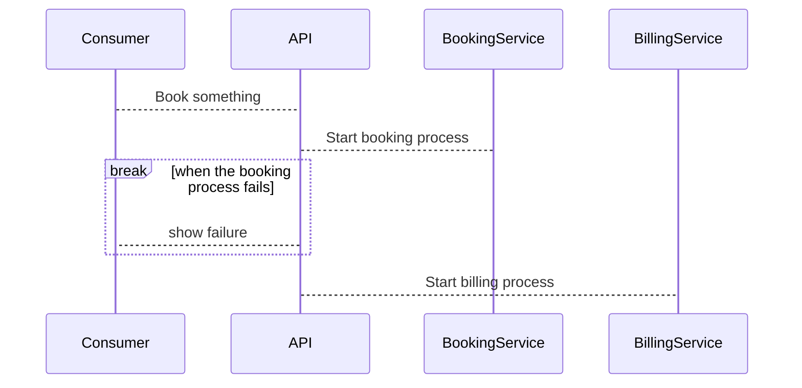
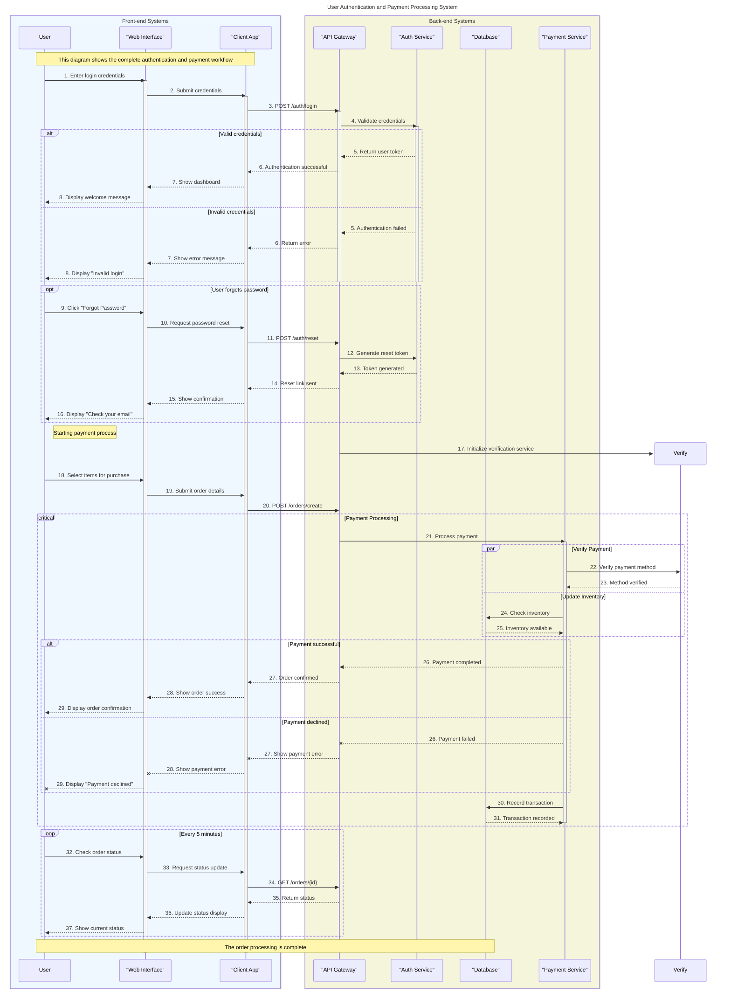

# Mermaid theming tests

[toc]

## Architecture

```mermaid
architecture-beta
    group public_cloud(cloud)[Complete Architecture Example]
        group web_tier(server)[Web Tier] in public_cloud
            service web1(server)[Web Server 1] in web_tier
            service web2(server)[Web Server 2] in web_tier

        group app_tier(database)[Application Tier] in public_cloud
            service app1(server)[App Server 1] in app_tier
            service app2(server)[App Server 2] in app_tier
            service cache(database)[Cache] in app_tier

        group data_tier(disk)[Data Tier] in public_cloud
            service primary_db(database)[Primary DB] in data_tier
            service replica_db(database)[Replica DB] in data_tier
            service storage(disk)[Storage] in data_tier

    group private_network(internet)[Private Network]
        service monitor(server)[Monitoring] in private_network
        service backup(disk)[Backup] in private_network

    junction internet_gateway

    web1:R --> L:app1
    web2:R --> L:app2

    app1:R -- L:cache
    app2:R -- L:cache

    app1:B --> T:primary_db
    app2:B -- T:replica_db
    primary_db:R -- L:storage
    replica_db:R -- L:storage

    internet_gateway:R --> L:web1
    internet_gateway:B --> T:monitor

    monitor:R --> L:web2
    backup:T <--> B:primary_db

    web1{group}:B --> T:monitor{group}
```

## User Journey

```mermaid
journey
    title Customer Journey Through E-Commerce Site
    section Homepage
      Visit homepage: 5: User
      Browse featured products: 4: User
      Use search function: 3: User
    section Product Browsing
      View category listings: 5: User
      Use filters: 3: User
      View product details: 5: User
    section Purchase Process
      Add to cart: 5: User
      View cart: 5: User
      Enter shipping info: 3: User
      Enter payment details: 2: User
      Complete purchase: 4: User
    section Post-Purchase
      Receive order confirmation: 5: User
      Track shipment: 4: User
      Receive product: 5: User
      Leave review: 2: User
```

## Timeline

```mermaid
timeline
    title History of Web Accessibility
    section 1990s
        1994 : Creation of the Web Accessibility Initiative (WAI)
        1997 : First draft of WCAG published
        1999 : WCAG 1.0 becomes official W3C Recommendation
    section 2000s
        2000 : Section 508 of the US Rehabilitation Act amended
        2005 : ARIA (Accessible Rich Internet Applications) development begins
        2008 : WCAG 2.0 becomes official W3C Recommendation
    section 2010s
        2012 : W3C and HTML5
        2017 : EN 301 549 European Accessibility requirements
        2018 : WCAG 2.1 becomes official W3C Recommendation
    section 2020s
        2020 : More mobile accessibility focus
        2021 : WCAG 2.2 draft
        2023 : WCAG 2.2 becomes official W3C Recommendation
```

## Pie Chart

```mermaid
pie title Website Traffic Sources
    "Direct" : 30.1
    "Organic Search" : 44.3
    "Referral" : 10.2
    "Social Media" : 8.7
    "Email" : 5.4
    "Other" : 1.3
```

## Mindmap

```mermaid
mindmap
  root((Digital Accessibility Education))
    Contextual Challenges
      Individual Heroes
        Reliance on champions
        Lack of formal recognition
        Vulnerable to turnover
        Unsustainable model
      Engagement Issues
        Siloed departments
        Disciplinary barriers
        Varied role expectations
        Inconsistent values
      Industry-Academia Gap
        Insufficient university training
        Disconnect in expectations
        Need for foundational training
        Limited cross-sector dialogue
      Community Challenges
        Dispersed expertise
        Limited new entrants
        Unclear career paths
        Gatekeeping concerns
      Currency Problems
        Declining topic emphasis
        Competition with new trends
        Funding challenges
        Need for reframing
    Building Capacity
      Embedded Integration
        Centers of excellence
        Cross-disciplinary approach
        Institutional support
        Sustained mentoring
      Professional Development
        Industry connections
        Real-world projects
        Work placements
        Career pathways
      Learning Approaches
        Self-directed learning
        Informal networks
        Bootcamps
        Online resources
      Cross-Role Collaboration
        Interdisciplinary teaching
        Role-based training
        Shared responsibilities
        Communication skills
      Communities of Practice
        Knowledge sharing
        Pedagogical innovation
        Cross-sector dialogue
        Sustained networks
```

## Gantt

```mermaid
gantt
    title Complex Project Management with Multiple Features
    dateFormat  YYYY-MM-DD
    axisFormat  %d-%b

    %% Configure exclusions
    excludes weekends
    excludes 2023-12-25, 2023-12-26, 2024-01-01

    %% Project Initiation Phase
    section Project Initiation
    Project Kickoff             :init1, 2023-11-01, 0d
    Requirements Gathering      :req1, after init1, 10d
    Stakeholder Interviews      :int1, after init1, 5d
    Initial Documentation       :doc1, after int1, 7d
    Risk Assessment             :risk1, after req1, 4d
    Phase Review Meeting        :rev1, after doc1, 0d

    %% Design Phase
    section Design
    Architecture Planning       :arch1, after rev1, 8d
    Interface Design            :ui1, after rev1, 12d
    Technical Specification     :tech1, after arch1, 8d
    Security Planning           :sec1, after arch1, 6d
    Design Review               :drev1, after tech1, 0d

    %% Development Phase
    section Development
    Backend Development         :back1, after drev1, 20d
    Frontend Development        :front1, after drev1, 15d
    Database Implementation     :db1, after drev1, 12d
    API Integration             :api1, after back1, 5d
    Initial Testing             :test1, after front1, 8d
    Code Freeze                 :cf1, after api1, 0d

    %% Testing Phase
    section Testing
    Test Planning               :plan1, after cf1, 3d
    Unit Testing                :unit1, after plan1, 5d
    Integration Testing         :int2, after plan1, 10d
    Performance Testing         :perf1, after int2, 5d
    User Acceptance Testing     :uat1, after int2, 8d
    Bug Fixing                  :bug1, after unit1, 10d
    Final Test Approval         :test2, after uat1, 0d

    %% Deployment Phase
    section Deployment
    Deployment Planning         :dep1, after int2, 3d
    Training Materials          :tm1, after int2, 8d
    Environment Setup           :env1, after dep1, 4d
    User Training               :train1, after tm1, 5d
    Deployment Window           :deploy1, after test2, 2d
    Go Live                     :live1, after deploy1, 0d
    Post-Launch Support         :ps1, after live1, 10d
    Project Closure             :close1, after ps1, 0d
```

## Basic Flowchart

```mermaid
graph TB
    A[Start] --> B{Is it raining?}
    B -->|Yes| C[Take umbrella]
    B -->|No| D[Take sunglasses]
    C --> E[Go out]
    D --> E
    E --> F[Return home]
```

## Sequence break

```mermaid
sequenceDiagram
    Consumer-->API: Book something
    API-->BookingService: Start booking process
    break when the booking process fails
        API-->Consumer: show failure
    end
    API-->BillingService: Start billing process
```

## Sequence

```mermaid
sequenceDiagram
    %% Title directive for the diagram
    title User Authentication and Payment Processing System

    %% Group for front-end components
    box rgb(240,248,255) Front-end Systems
        participant User as User
        participant UI as "Web Interface"
        participant Client as "Client App"
    end

    %% Group for back-end components
    box rgb(245,245,220) Back-end Systems
        participant API as "API Gateway"
        participant Auth as "Auth Service"
        participant DB as "Database"
        participant Payment as "Payment Service"
    end

    %% Initial note explaining the flow
    Note over User, Client: This diagram shows the complete authentication and payment workflow

    %% 1. Authentication Flow with Activation
    User->>UI: 1. Enter login credentials
    activate UI
    UI->>Client: 2. Submit credentials
    activate Client
    Client->>API: 3. POST /auth/login
    activate API
    API->>Auth: 4. Validate credentials
    activate Auth

    %% Alt block for authentication outcomes
    alt Valid credentials
        Auth-->>API: 5. Return user token
        API-->>Client: 6. Authentication successful
        Client-->>UI: 7. Show dashboard
        UI-->>User: 8. Display welcome message
    else Invalid credentials
        Auth-->>API: 5. Authentication failed
        API-->>Client: 6. Return error
        Client-->>UI: 7. Show error message
        UI-->>User: 8. Display "Invalid login"
    end

    deactivate Auth
    deactivate API

    %% Opt block for password reset (optional flow)
    opt User forgets password
        User->>UI: 9. Click "Forgot Password"
        UI->>Client: 10. Request password reset
        Client->>API: 11. POST /auth/reset
        API->>Auth: 12. Generate reset token
        Auth-->>API: 13. Token generated
        API-->>Client: 14. Reset link sent
        Client-->>UI: 15. Show confirmation
        UI-->>User: 16. Display "Check your email"
    end

    %% 2. Payment Flow with dynamic participant creation
    Note right of User: Starting payment process

    %% Proper participant creation - must have a message to it immediately after creation
    create participant Verify
    API->>Verify: 17. Initialize verification service

    User->>UI: 18. Select items for purchase
    UI->>Client: 19. Submit order details
    Client->>API: 20. POST /orders/create

    %% Critical block for payment processing
    critical Payment Processing
        API->>Payment: 21. Process payment
        activate Payment

        %% Use parallel block for concurrent operations
        par Verify Payment
            Payment->>Verify: 22. Verify payment method
            Verify-->>Payment: 23. Method verified
        and Update Inventory
            Payment->>DB: 24. Check inventory
            DB-->>Payment: 25. Inventory available
        end

        %% Alt block for payment outcomes
        alt Payment successful
            Payment-->>API: 26. Payment completed
            API-->>Client: 27. Order confirmed
            Client-->>UI: 28. Show order success
            UI-->>User: 29. Display order confirmation
        else Payment declined
            Payment--xAPI: 26. Payment failed
            API--xClient: 27. Show payment error
            Client--xUI: 28. Show payment error
            UI--xUser: 29. Display "Payment declined"
            %% Comment explaining the flow
            %% This would normally terminate the sequence in a break block
        end

        Payment->>DB: 30. Record transaction
        DB-->>Payment: 31. Transaction recorded
        deactivate Payment
    end

    %% Loop block for order tracking requests
    loop Every 5 minutes
        User->>UI: 32. Check order status
        UI->>Client: 33. Request status update
        Client->>API: 34. GET /orders/{id}
        API-->>Client: 35. Return status
        Client-->>UI: 36. Update status display
        UI-->>User: 37. Show current status
    end

    %% Destroy a service when no longer needed
    destroy Verify

    %% Final note
    Note over User, DB: The order processing is complete

    %% Deactivate remaining components
    deactivate Client
    deactivate UI
```
