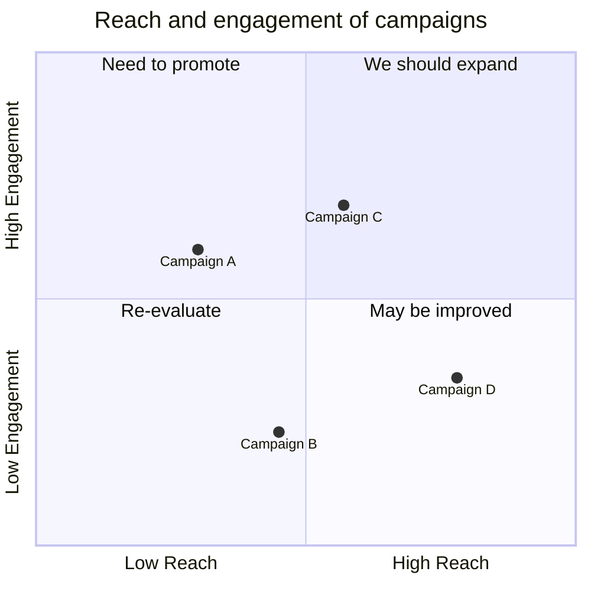
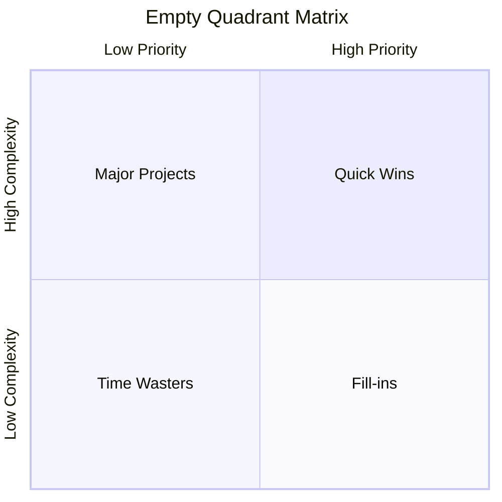
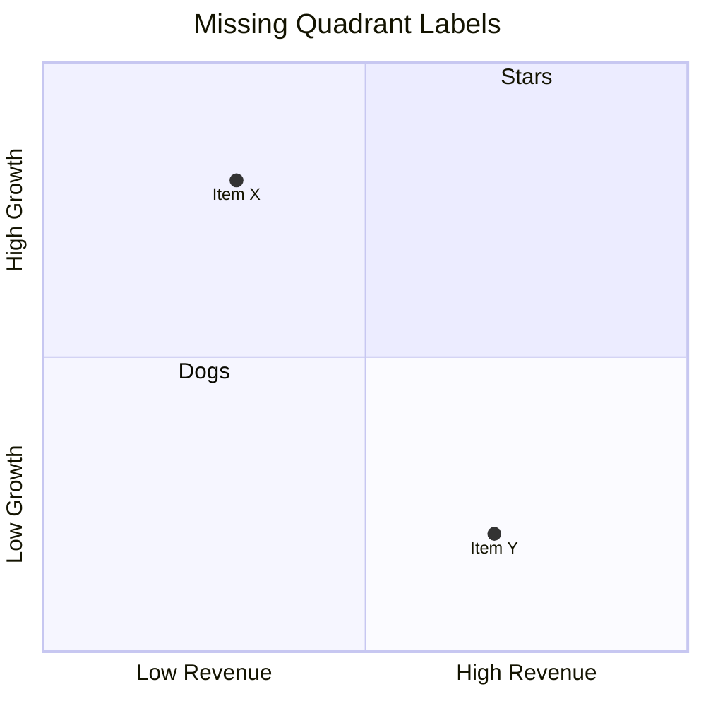
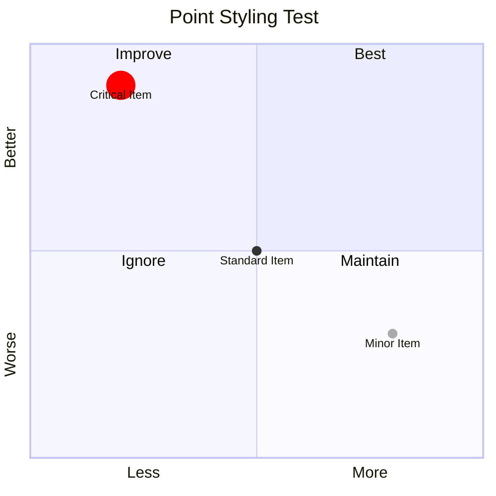
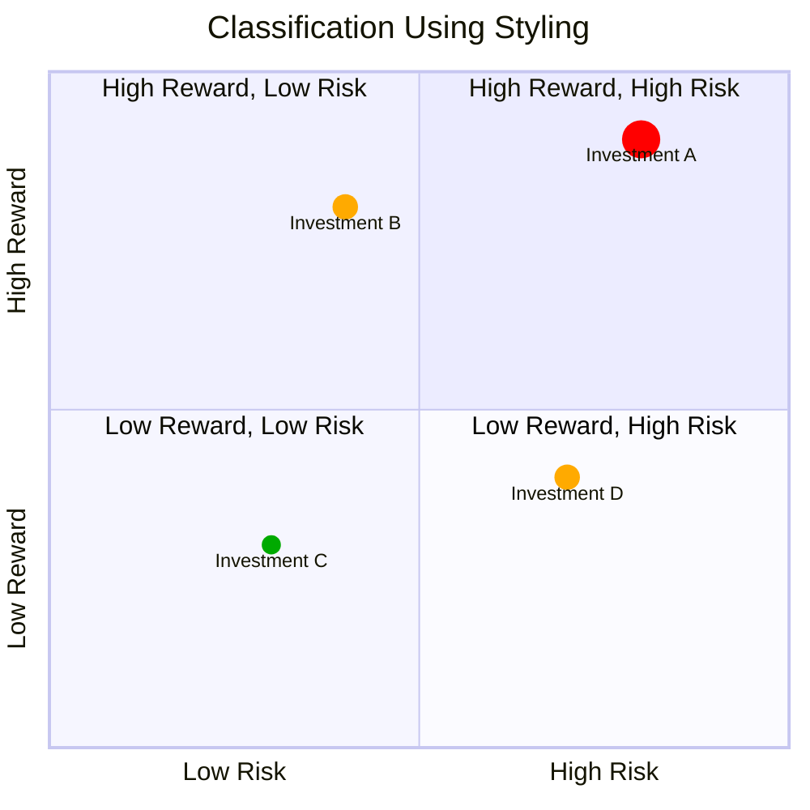
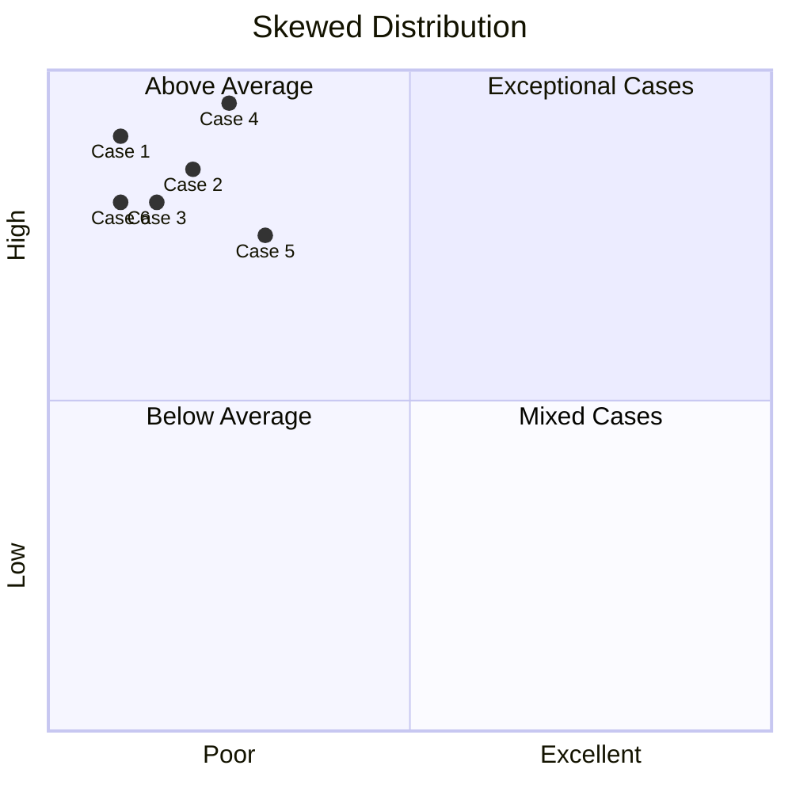
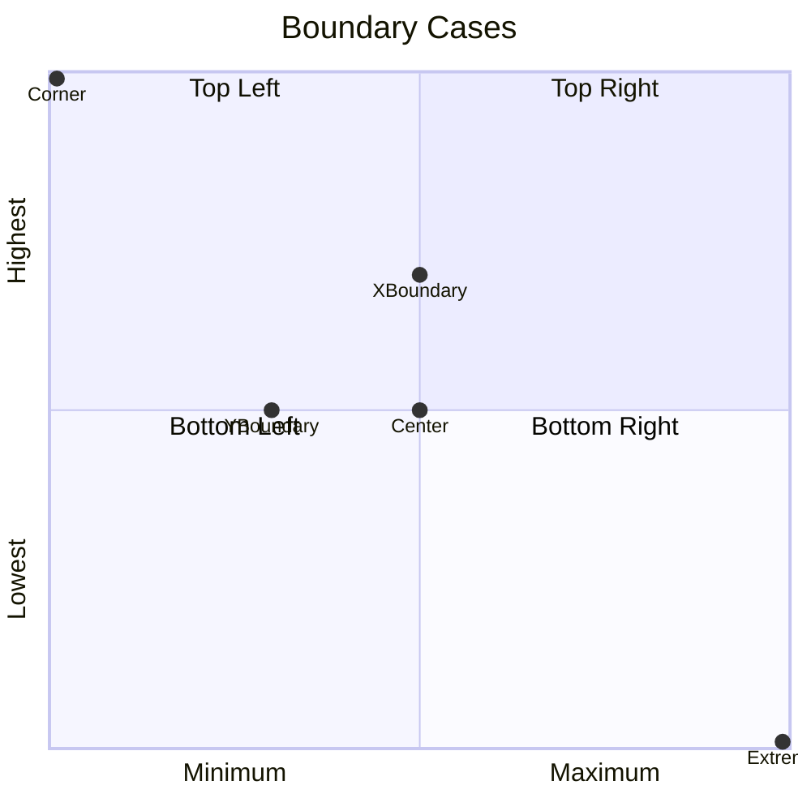

# Quadrant Chart Edge Case Testing Guide

Here are detailed test cases for the edge cases in the quadrant chart accessibility module, with expected results for each one.

## 1. Empty Charts Test

This tests how the module handles quadrant charts with no data points.

### Test Example:

### Expected Results:

**Short Description should:**

- Mention it's a quadrant chart with the title "Empty Quadrant Matrix"
- Include the axis labels ("Low Priority to High Priority" and "Low Complexity to High Complexity")
- Not mention any points or point distribution
- Example: "A quadrant chart titled 'Empty Quadrant Matrix' showing the relationship between Low Priority to High Priority and Low Complexity to High Complexity. Contains 0 data points."

**Detailed Description should:**

- Include all quadrant labels in the Framework section
- Explicitly state "This chart contains no data points" in the Distribution section
- Not include the Points section at all (since there are no points to describe)
- Show all sections (Overview, Framework, Distribution, Visual Note) except the Points section

## 2. Missing Labels Tests

### 2.2 Missing Quadrant Labels

### Expected Results:

**Short Description should:**

- Mention the complete axis labels
- Not specifically mention missing quadrant labels

**Detailed Description should:**

- List "Quadrant 2 (top-left): Unlabelled" in the framework section
- List "Quadrant 4 (bottom-right): Unlabelled" in the framework section
- When describing points in unlabelled quadrants, use the position description instead of the label

## 3. Point Styling Tests

### 3.1 Direct Styling

### Expected Results:

**Short Description should:**

- Not mention styling information (keeping it concise)

**Detailed Description should:**

- Include a note in the Visual Representation section like: "Some points have custom visual styling that may indicate different categories or importance."
- Not excessively detail the styling attributes as they're visual and not essential for understanding the content
- Still correctly identify the quadrant for each point regardless of styling

### 3.2 Class-based Styling

### Expected Results:

**Short Description should:**

- Focus on the distribution of points across quadrants, not the styling

**Detailed Description should:**

- Include the styling note in the Visual Representation section
- Properly handle the class attribution when parsing
- Not let the styling information distract from the primary content analysis
- Correctly determine point quadrants regardless of styling

## 4. Complex Distribution Test

### Expected Results:

**Short Description should:**

- Mention that most points fall in the top-left (quadrant 2) quadrant
- Example: "A quadrant chart titled 'Skewed Distribution' showing the relationship between Poor to Excellent and Low to High. Contains 6 data points, with most falling in the Above Average quadrant (top-left)."

**Detailed Description should:**

- In the Distribution section, show the correct percentage breakdown (all or most points in quadrant 2)
- Note that some quadrants are empty (3 and 4)
- Example in Distribution section: "Note: Quadrants 3, 4 are empty."

## 5. Boundary Case Test

