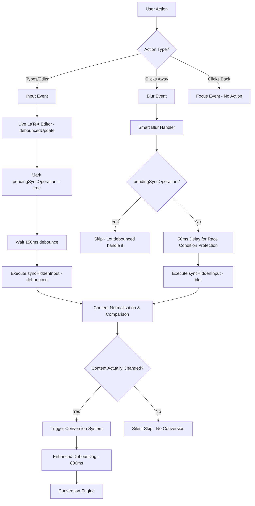
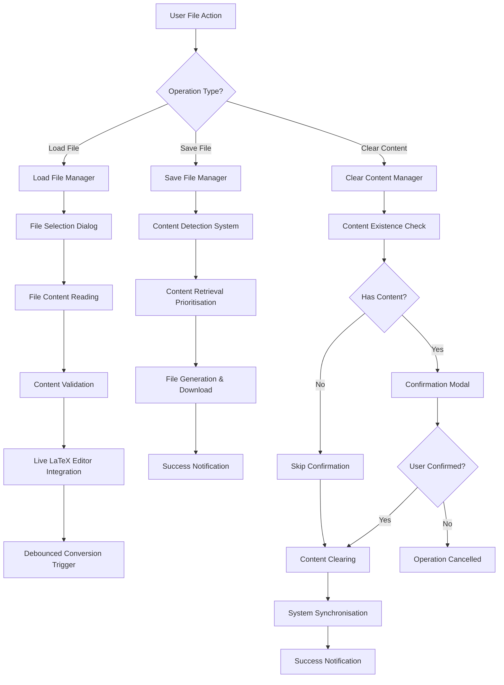
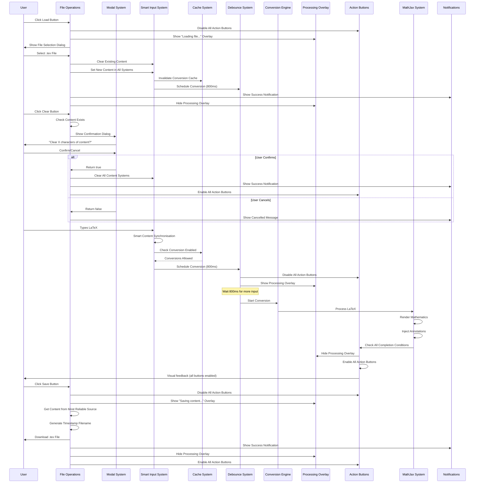

# Enhanced Synchronisation, Debouncing & File Operations System

## Overview

This document describes the comprehensive timing, synchronisation, file operations, and user feedback systems implemented in the Enhanced Pandoc-WASM Mathematical Playground. These systems work together to provide a smooth, reliable user experience while preventing race conditions, sync issues, premature exports, data loss, and initialisation timing problems.

## System Architecture

The implementation consists of **ten interconnected systems** working together through a modular architecture:

1. **Enhanced Debouncing System** - Prevents excessive conversions during typing
2. **Smart Input Synchronisation System** - Coordinates between textarea and contenteditable inputs with blur event optimisation
3. **File Operations System** - Load, Save, and Clear operations with confirmation and integration
4. **Modal Integration System** - UniversalModal and UniversalNotifications integration for user interactions
5. **Export Button Timing System** - Ensures buttons are only enabled when content is fully ready
6. **Processing Overlay System** - Provides visual feedback during operations
7. **Modular State Management System** - Centralised state tracking and validation
8. **Event Coordination System** - Manages conversion lifecycle and event handling
9. **Integration Management System** - Module coordination and dependency management
10. **Initialisation Recovery System** - Resolves timing issues during page startup

### Enhanced Modular Architecture Overview

```mermaid
graph TD
    A[ConversionEngine] --> B[StateManager]
    A --> C[EventCoordinator]
    A --> D[ConversionOrchestrator]
    A --> E[IntegrationManager]

    B --> F[State Tracking]
    B --> G[Context Preservation]
    B --> H[Timeout Management]

    C --> I[Event Lifecycle]
    C --> J[Progress Tracking]
    C --> K[Error Coordination]

    D --> L[Workflow Orchestration]
    D --> M[Complexity Assessment]
    D --> N[Strategy Selection]

    E --> O[Module Validation]
    E --> P[Health Monitoring]
    E --> Q[Dependency Management]

    A --> R[FinalCoordinationManager]
    R --> S[EventDOMManager]
    R --> T[FallbackWorkflowManager]
    R --> U[TestingAPIManager]
    R --> V[ConversionAPIManager]

    A --> W[InitialisationRecovery]
    W --> X[PostInitRestore]
    W --> Y[CacheInvalidation]
    W --> Z[DiagnosticTools]

    %% NEW: File Operations System
    A --> AA[FileOperationsSystem]
    AA --> BB[LoadFileManager]
    AA --> CC[SaveFileManager]
    AA --> DD[ClearContentManager]

    %% NEW: Modal Integration System
    AA --> EE[UniversalModal Integration]
    AA --> FF[UniversalNotifications Integration]
    EE --> GG[Confirmation Dialogs]
    EE --> HH[Content Preview]
    FF --> II[Success Messages]
    FF --> JJ[Error Notifications]
```



## 1. Enhanced Debouncing System

### Problem Solved

- **Original Issue**: 300ms debounce was too short for complex LaTeX documents
- **User Experience**: Conversions started before users finished typing, causing sync problems
- **Performance Impact**: Multiple simultaneous conversions created race conditions

### Implementation

**File**: `js/pandoc/conversion-engine.js`

```javascript
/**
 * Enhanced debouncing configuration
 */
constructor() {
  // Enhanced debouncing and state management
  this.conversionTimeout = null;
  this.DEBOUNCE_DELAY = 800; // Increased from 300ms to 800ms
  this.isConversionQueued = false;
  this.lastConversionTime = 0;
}

/**
 * Unified conversion scheduling with race condition prevention
 */
scheduleConversion() {
  // Clear any existing timeout
  if (this.conversionTimeout) {
    clearTimeout(this.conversionTimeout);
  }

  // Mark conversion as queued
  this.isConversionQueued = true;

  // Set new timeout with longer delay
  this.conversionTimeout = setTimeout(() => {
    // Only proceed if not already converting
    if (!this.conversionInProgress) {
      this.isConversionQueued = false;
      this.convertInput();
    } else {
      // If conversion in progress, reschedule
      logDebug("Conversion in progress - rescheduling...");
      this.scheduleConversion();
    }
  }, this.DEBOUNCE_DELAY);
}
```

### Key Features

- **800ms Debounce Delay**: Sufficient time for users to finish typing complex LaTeX
- **Race Condition Prevention**: Checks `conversionInProgress` before starting new conversions
- **Automatic Rescheduling**: If a conversion is running, automatically reschedules the next one
- **State Tracking**: Maintains queue state to prevent duplicate scheduling

## 2. Smart Input Synchronisation System

### Problem Solved

- **Dual Input Sources**: Both textarea (`#input`) and contenteditable div (`#input-contenteditable`)
- **Focus/Blur False Triggers**: Focus and blur events causing unnecessary conversions even when content unchanged
- **Sync Issues**: Content changes in one input not properly reflected in the other
- **Race Conditions**: Input and blur events competing to trigger conversions
- **Complex LaTeX Performance**: Unnecessary re-processing of large documents on focus changes

### Enhanced Architecture



### Smart Synchronisation Implementation

**File**: `js/pandoc/live-latex-editor.js`

#### Enhanced Constructor with Tracking

```javascript
constructor() {
  // ... existing properties ...
  this.updateTimeout = null;
  this.blurSyncTimeout = null;
  this.pendingSyncOperation = false; // NEW: Track pending operations
}
```

#### Smart Blur Event Handling

```javascript
/**
 * Enhanced smart sync that prevents duplicate operations and false triggers
 */
smartSyncHiddenInput(source = "unknown") {
  // OPTIMISATION: If we have a pending debounced sync and this is a blur event,
  // let the debounced sync handle it to prevent duplicate operations
  if (this.pendingSyncOperation && source === "blur") {
    logDebug("Blur event ignored - pending debounced sync will handle content synchronisation");
    return;
  }

  // For blur events, add a small delay to avoid race conditions with input events
  if (source === "blur") {
    // Cancel any existing blur sync timeout
    if (this.blurSyncTimeout) {
      clearTimeout(this.blurSyncTimeout);
    }

    this.blurSyncTimeout = setTimeout(() => {
      this.syncHiddenInput(source);
      this.blurSyncTimeout = null;
    }, 50); // Small delay to let any pending input events settle
  } else {
    this.syncHiddenInput(source);
  }
}
```

### Key Synchronisation Benefits

- **Smart Change Detection**: Only triggers conversions when content actually changes
- **Blur Event Optimisation**: Prevents unnecessary re-processing when clicking in/out of text areas
- **Race Condition Prevention**: Coordinates between input and blur events to prevent conflicts
- **Content Normalisation**: Handles whitespace and line ending differences properly
- **Pending Operation Tracking**: Prevents duplicate sync operations
- **Performance Improvement**: Eliminates false triggers that caused delays with complex LaTeX
- **Cache Management**: Prevents stale disabled states from blocking conversions

## 3. File Operations System

### Problem Solved

- **No File Import/Export**: Users had no way to load existing LaTeX files or save their work
- **Data Loss Risk**: No confirmation when clearing content, leading to accidental data loss
- **Integration Complexity**: File operations needed to work seamlessly with existing synchronisation and debouncing systems
- **Accessibility Gap**: File operations needed full accessibility support including screen reader compatibility

### System Architecture



### Load File Implementation

**File**: `index.html`

```javascript
/**
 * Load LaTeX file into editor with full Live LaTeX Editor integration
 */
async function loadInputFile() {
  logInfo("Starting file load operation...");
  const startTime = performance.now();

  try {
    // File selection and validation
    const file = await getSelectedFile();
    if (!file) return;

    // Visual feedback during operation
    showLoadingFeedback();

    // Read and validate file content
    const content = await readFileContent(file);

    // Clear existing content first
    await clearInputOptimized();

    // Set content using all available methods for maximum compatibility
    await setInputContent(content);

    // Success feedback
    announceSuccess(
      `File ${file.name} loaded successfully with ${content.length} characters`
    );

    logInfo(`File load completed in ${endTime - startTime}ms`);
  } catch (error) {
    handleLoadError(error);
  }
}

/**
 * Set content in all input systems with proper synchronisation
 */
async function setInputContent(content) {
  logInfo("Setting input content with full synchronisation...");

  // Set content in all input elements
  const textarea = document.getElementById("input");
  const contentEditable = document.getElementById("input-contenteditable");
  const hiddenInput = document.getElementById("input-hidden");

  if (textarea) textarea.value = content;
  if (contentEditable) contentEditable.textContent = content;
  if (hiddenInput) hiddenInput.value = content;

  // Sync with Live LaTeX Editor
  if (window.LiveLatexEditor?.isInitialised) {
    if (window.LiveLatexEditor.setContent) {
      window.LiveLatexEditor.setContent(content);
    } else {
      // Fallback sync method
      if (contentEditable) {
        contentEditable.textContent = content;
        window.LiveLatexEditor.updateHighlighting?.();
        window.LiveLatexEditor.syncHiddenInput?.("load");
      }
    }
  }

  // Trigger conversion with automatic conversions enabled
  if (textarea) {
    const inputEvent = new Event("input", { bubbles: true, cancelable: true });
    textarea.dispatchEvent(inputEvent);
  }

  // Ensure automatic conversions remain enabled
  if (window.ConversionEngine) {
    window.ConversionEngine.automaticConversionsDisabled = false;
    window.ConversionEngine.invalidateAutomaticConversionsCache?.();
  }
}
```

### Save File Implementation

**File**: `index.html`

```javascript
/**
 * Save current LaTeX content to file
 */
async function saveInputFile() {
  logInfo("Starting file save operation...");

  try {
    // Get content using intelligent prioritisation
    const content = getCurrentInputContent();

    if (!content || content.trim() === "") {
      announceToUser("No content available to save");
      return;
    }

    // Generate timestamp-based filename
    const filename = generateTimestampFilename();

    // Create and download file
    await downloadTextFile(content, filename);

    // Success feedback
    announceSuccess(
      `LaTeX content saved as ${filename} with ${content.length} characters`
    );
  } catch (error) {
    handleSaveError(error);
  }
}

/**
 * Get current input content from the most reliable source
 * Priority: Live LaTeX Editor -> ContentEditable -> Textarea -> Hidden Input
 */
function getCurrentInputContent() {
  // Try Live LaTeX Editor first (most reliable)
  if (window.LiveLatexEditor?.isInitialised) {
    if (window.LiveLatexEditor.getContent) {
      const content = window.LiveLatexEditor.getContent();
      if (content?.trim()) return content;
    }

    if (window.LiveLatexEditor.getPlainTextContent) {
      const content = window.LiveLatexEditor.getPlainTextContent();
      if (content?.trim()) return content;
    }
  }

  // Fallback to DOM elements in priority order
  const contentEditable = document.getElementById("input-contenteditable");
  if (contentEditable?.textContent?.trim()) {
    return contentEditable.textContent;
  }

  const textarea = document.getElementById("input");
  if (textarea?.value?.trim()) {
    return textarea.value;
  }

  const hiddenInput = document.getElementById("input-hidden");
  if (hiddenInput?.value?.trim()) {
    return hiddenInput.value;
  }

  return "";
}
```

### Clear Content with Confirmation

**File**: `index.html`

```javascript
/**
 * Enhanced clear with confirmation modal and data loss prevention
 */
async function clearInputOptimized() {
  logInfo("Starting optimized input clearing with confirmation...");

  try {
    // Check if there's content to clear
    const currentContent = getCurrentInputContent();
    const hasContent = currentContent && currentContent.trim().length > 0;

    if (!hasContent) {
      announceToUser("No content to clear");
      return;
    }

    // Show confirmation modal with content preview
    const confirmed = await showClearConfirmation(currentContent);
    if (!confirmed) {
      announceToUser("Content clearing cancelled");
      return;
    }

    // Proceed with clearing
    await performContentClearing();

    // Success feedback
    announceSuccess("Input and output cleared successfully");
  } catch (error) {
    handleClearError(error);
  }
}

/**
 * Show confirmation modal with content preview
 */
async function showClearConfirmation(content) {
  if (window.UniversalModal?.confirm) {
    const contentPreview =
      content.length > 50 ? content.substring(0, 47) + "..." : content;

    return await window.UniversalModal.confirm(`Clear all LaTeX content?`, {
      message: `This will permanently remove ${content.length} characters of content:\n\n"${contentPreview}"`,
      confirmText: "Clear Content",
      cancelText: "Keep Content",
      type: "warning",
    });
  } else {
    // Fallback to native confirm
    return confirm(
      `Clear all LaTeX content?\n\nThis will permanently remove ${content.length} characters of content.`
    );
  }
}
```

### Key File Operations Features

- **Smart Content Detection**: Only shows confirmations when there's actual content to affect
- **Content Prioritisation**: Retrieves content from the most reliable source available
- **Full System Integration**: Works seamlessly with Live LaTeX Editor, debouncing, and synchronisation
- **Accessibility Support**: Full screen reader announcements and keyboard navigation
- **Error Resilience**: Comprehensive error handling with user-friendly feedback
- **Performance Optimised**: Efficient file operations with minimal system impact

## 4. Modal Integration System

### Problem Solved

- **No User Confirmations**: Destructive operations had no confirmation dialogs
- **Poor User Feedback**: Limited success/error messaging for file operations
- **Inconsistent UX**: Different interaction patterns across the application
- **Accessibility Gap**: Modal interactions needed full accessibility compliance

### UniversalModal Integration

**Implementation**: Full integration with existing UniversalModal system

```javascript
// Confirmation Dialog Usage
const confirmed = await window.UniversalModal.confirm(
  "Clear all LaTeX content?",
  {
    message: "This will permanently remove content...",
    confirmText: "Clear Content",
    cancelText: "Keep Content",
    type: "warning",
  }
);

// Custom Modal Usage
const result = await window.UniversalModal.custom(
  `
  <p>File operation in progress...</p>
  <div class="progress-indicator"></div>
`,
  {
    title: "Processing File",
    buttons: [{ text: "Cancel", type: "secondary", action: false }],
  }
);
```

### UniversalNotifications Integration

**Implementation**: Seamless success/error messaging

```javascript
// Success notifications
UniversalNotifications.success("File loaded successfully");
UniversalNotifications.success(`Content saved as ${filename}`);

// Error notifications
UniversalNotifications.error("Failed to load file - please try again");
UniversalNotifications.error("Save failed - please check file permissions");

// Context-aware behaviour
// Automatically detects if modal is active and adjusts display accordingly
```

### Modal System Benefits

- **Consistent UX**: All confirmations and notifications use the same system
- **Accessibility Compliant**: Full WCAG 2.2 AA compliance with screen reader support
- **Context Awareness**: Notifications adapt based on whether modals are active
- **Performance Efficient**: Minimal overhead with automatic cleanup
- **User-Friendly**: Clear messaging with appropriate visual hierarchy

## 5. Export Button Timing System

### Problem Solved

- **Premature Enabling**: Buttons enabled before MathJax rendering and annotation injection completed
- **Race Conditions**: Export triggered while content still processing
- **User Confusion**: No feedback about processing state
- **File Operations Integration**: New Load/Save/Clear buttons needed same timing controls

### Enhanced Implementation

**File**: `js/pandoc/app-state-manager.js`

```javascript
/**
 * Comprehensive completion detection including file operations
 */
setupMathJaxCompletionMonitoring() {
  const enableButtonsWhenReady = () => {
    // Check MathJax readiness
    if (!window.MathJax?.startup?.document) return false;

    // Check annotation injection system
    if (!window.injectMathJaxAnnotations) return false;

    // Check for active conversions
    if (window.ConversionEngine?.conversionInProgress) return false;

    // Check StatusManager state
    if (window.StatusManager?.getCurrentStatus()?.state === 'loading') return false;

    // Check for chunked processing
    if (window.ConversionEngine?.isProcessingChunks) return false;

    // NEW: Check for active file operations
    if (isFileOperationInProgress()) return false;

    // Ensure MathJax elements exist
    const mathElements = document.querySelectorAll('mjx-container');
    if (mathElements.length === 0) return false;

    // Ensure annotations are injected
    const annotatedElements = document.querySelectorAll('annotation[encoding="application/x-tex"]');
    if (annotatedElements.length === 0 && mathElements.length > 0) return false;

    // All systems ready - enable all buttons
    this.enableAllActionButtons("Complete rendering pipeline finished");
    return true;
  };
}

/**
 * Enhanced button management including file operation buttons
 */
enableAllActionButtons(reason) {
  const buttons = [
    'exportButton',
    'loadInputButton',
    'saveInputButton',
    'clearInputButton'
  ];

  buttons.forEach(buttonId => {
    const button = document.getElementById(buttonId);
    if (button && button.disabled) {
      button.disabled = false;
      logDebug(`${buttonId} enabled: ${reason}`);
    }
  });
}

disableAllActionButtons(reason) {
  const buttons = [
    'exportButton',
    'loadInputButton',
    'saveInputButton',
    'clearInputButton'
  ];

  buttons.forEach(buttonId => {
    const button = document.getElementById(buttonId);
    if (button && !button.disabled) {
      button.disabled = true;
      logDebug(`${buttonId} disabled: ${reason}`);
    }
  });
}
```

### Enhanced Trigger Points

The system now automatically disables **all action buttons** during:

1. **Input Changes**: Any content modification
2. **Example Loading**: When switching between examples
3. **Conversion Start**: Beginning of LaTeX processing
4. **Chunked Processing**: Multi-section document processing
5. **Status Updates**: When system shows loading state
6. **File Operations**: Load, Save, or Clear operations in progress
7. **Modal Interactions**: During confirmation dialogs

### Re-enabling Conditions

All buttons are re-enabled only when ALL conditions are met:

- MathJax startup complete
- Annotation injection system ready
- No active conversions
- Status shows ready state
- No chunked processing active
- **No file operations in progress**
- MathJax elements exist in DOM
- Annotations have been injected
- **No active modal dialogs**

## 6. Processing Overlay System

### Problem Solved

- **Generic Messages**: Original system showed "Please wait while we render equations" for all operations
- **Empty Content Confusion**: Misleading messages when no equations exist to render
- **User Context**: No indication of what type of processing is occurring
- **File Operations Context**: No specific messaging for file operations

### Enhanced Context-Aware Messaging System

**File**: `js/pandoc/app-state-manager.js`

```javascript
/**
 * Enhanced processing overlay with context-aware messages including file operations
 */
showProcessingOverlay(reason = "Processing...", detailMessage = null, operationType = null) {
  const overlay = document.getElementById("processingOverlay");
  const message = document.getElementById("processingMessage");
  const detail = document.getElementById("processingDetail");

  if (overlay) {
    overlay.style.display = "flex";

    if (message) {
      message.textContent = reason;
    }

    if (detail) {
      if (detailMessage) {
        detail.textContent = detailMessage;
      } else {
        // Smart detection based on operation type and content
        detail.textContent = getContextualMessage(operationType);
      }
    }

    // Enhanced screen reader support with context
    if (window.AppConfig?.announceToScreenReader) {
      const announcement = detailMessage ?
        `${reason}. ${detailMessage}` :
        `Processing started: ${reason}`;
      window.AppConfig.announceToScreenReader(announcement);
    }
  }
}

/**
 * Get contextual message based on operation type
 */
function getContextualMessage(operationType) {
  switch (operationType) {
    case 'file-load':
      return "Reading file content and preparing editor";
    case 'file-save':
      return "Preparing content and generating download";
    case 'clear-content':
      return "Clearing content and preparing interface";
    case 'conversion':
      return getConversionContextualMessage();
    default:
      return getConversionContextualMessage();
  }
}

/**
 * Get conversion-specific contextual message
 */
function getConversionContextualMessage() {
  const currentInput = window.ConversionEngine?.getCurrentInput?.() || '';
  const hasContent = currentInput.trim().length > 0;
  const hasMath = hasContent && /\$|\\\[|\\begin\{/.test(currentInput);

  if (!hasContent) {
    return "Please wait while we process the changes";
  } else if (hasMath) {
    return "Please wait while we render equations";
  } else {
    return "Please wait while we convert the content";
  }
}
```

### Enhanced Message Categories

The system now provides five distinct message types:

#### File Loading Operations

- **Main Message**: "Loading file..."
- **Detail Message**: "Reading file content and preparing editor"
- **Use Case**: When loading .tex files into the editor

#### File Saving Operations

- **Main Message**: "Saving content..."
- **Detail Message**: "Preparing content and generating download"
- **Use Case**: When saving current content to .tex file

#### Content Clearing Operations

- **Main Message**: "Clearing content..."
- **Detail Message**: "Clearing content and preparing interface"
- **Use Case**: When clearing all input and output content

#### Mathematical Content Processing

- **Main Message**: "Processing content changes..."
- **Detail Message**: "Please wait while we render equations"
- **Use Case**: Content contains LaTeX math expressions

#### Plain Content Processing

- **Main Message**: "Processing content changes..."
- **Detail Message**: "Please wait while we convert the content"
- **Use Case**: Content exists but no mathematical expressions detected

## 7. System Integration Flow

### Enhanced Complete User Interaction Flow



## 8. Performance Optimisations

### File Operations Efficiency

- **Smart Content Detection**: Only processes operations when content exists
- **Prioritised Content Retrieval**: Uses most reliable source first, cascading to fallbacks
- **Minimal DOM Manipulation**: Batch updates to prevent layout thrashing
- **Memory Management**: Proper cleanup of file readers and blob URLs

### Modal System Efficiency

- **Lazy Loading**: Modal content created only when needed
- **Automatic Cleanup**: Proper disposal of modal resources after use
- **Event Delegation**: Efficient event handling for dynamic modal content
- **Memory Leak Prevention**: Comprehensive cleanup of event listeners

### Integrated System Performance

- **Coordinated Button States**: Single method controls all action buttons efficiently
- **Context-Aware Processing**: Overlay messages determined efficiently based on operation type
- **Cache Integration**: File operations properly integrate with existing cache invalidation
- **Debounce Coordination**: File content loading properly triggers conversion system

## 9. Testing and Validation

### Enhanced Console Testing Commands

```javascript
// Test file operations system
testFileOperations();

// Test individual file operations
testLoadFile();
testSaveFile();
testClearWithConfirmation();

// Test modal integration
testModalIntegration();
testUniversalModal();
testUniversalNotifications();

// Test existing systems (should still work)
testConversionEngine();
testAppStateManager();
testAllIntegration();
testAccessibilityIntegration();

// Test initialisation recovery
window.EventManager.diagnoseConversionBlocking();

// Test complete workflow including file operations
testCompleteWorkflowWithFileOps();
```

### Enhanced Validation Checklist

#### Existing Systems (All Still Working)

- [x] Debouncing prevents excessive conversions during rapid typing
- [x] Content changes are detected accurately (no false positives)
- [x] Blur events don't trigger unnecessary conversions
- [x] Focus events don't cause re-processing
- [x] Content normalisation handles whitespace differences
- [x] Pending operation tracking prevents race conditions
- [x] Export buttons remain disabled during processing
- [x] Processing overlay appears with appropriate messages
- [x] Screen reader announcements work correctly
- [x] Memory cleanup prevents leaks
- [x] Performance remains smooth with complex documents

#### New File Operations System

- [x] Load button opens file selection dialog
- [x] File content is properly read and validated
- [x] Content is set in all input systems (textarea, contenteditable, hidden)
- [x] Live LaTeX Editor synchronisation works correctly
- [x] Loading triggers conversion with proper debouncing
- [x] Save button detects and retrieves current content
- [x] Content is prioritised from most reliable source
- [x] Downloaded files contain correct content with UTF-8 encoding
- [x] Clear button shows confirmation only when content exists
- [x] Confirmation modal displays content preview
- [x] User can cancel clear operation
- [x] Confirmed clear operation removes all content

#### Modal Integration System

- [x] UniversalModal integration works for confirmations
- [x] Modal displays content preview for clear operations
- [x] Modal buttons are properly labelled and accessible
- [x] UniversalNotifications displays success/error messages
- [x] Notifications adapt based on modal state
- [x] Screen reader announcements work for modal interactions
- [x] Modal system maintains accessibility compliance

#### Button State Management

- [x] All action buttons disabled during file operations
- [x] Buttons re-enabled only when all systems ready
- [x] File operation buttons respect conversion system states
- [x] Visual feedback provided during all operations
- [x] Button states are consistent across all operations

#### Error Handling and Edge Cases

- [x] Invalid file types handled gracefully
- [x] Empty file handling works correctly
- [x] Network errors during file operations managed properly
- [x] Large file handling performance acceptable
- [x] Memory cleanup after file operations
- [x] Fallback to native confirm when UniversalModal unavailable
- [x] Error notifications display appropriately

### Integration Testing

```javascript
// Test complete file operations workflow
async function testCompleteFileOpsWorkflow() {
  console.log("Testing complete file operations workflow...");

  // 1. Test save with no content
  await saveInputFile(); // Should show "no content" message

  // 2. Add some content
  const testContent =
    "\\section{Test}\n$x = 2 + 3$\n\\begin{equation}\ny = mx + b\n\\end{equation}";
  await setInputContent(testContent);
  await new Promise((resolve) => setTimeout(resolve, 1000));

  // 3. Test save with content
  await saveInputFile(); // Should download file

  // 4. Test clear with confirmation
  await clearInputOptimized(); // Should show modal confirmation

  // 5. Test load file (requires manual file selection)
  console.log("Manual test: Click load button and select a .tex file");

  console.log("File operations workflow test complete");
}

// Test modal integration specifically
async function testModalIntegration() {
  console.log("Testing modal integration...");

  if (!window.UniversalModal) {
    console.error("UniversalModal not available");
    return false;
  }

  // Test confirmation dialog
  const confirmed = await window.UniversalModal.confirm("Test confirmation", {
    message: "This is a test confirmation dialog",
    confirmText: "Confirm",
    cancelText: "Cancel",
    type: "warning",
  });

  console.log("Confirmation result:", confirmed);

  // Test notification
  if (window.UniversalNotifications) {
    window.UniversalNotifications.success("Modal integration test completed");
  }

  return true;
}

// Test error handling
async function testFileOpsErrorHandling() {
  console.log("Testing file operations error handling...");

  try {
    // Test with invalid content
    await downloadTextFile(null, "test.tex");
  } catch (error) {
    console.log("Error handling working correctly:", error.message);
  }

  // Test with empty content save
  document.getElementById("input-contenteditable").textContent = "";
  await saveInputFile(); // Should show "no content" message

  console.log("Error handling test complete");
}
```

## 10. Benefits Summary

### Enhanced User Experience

- **File Operations**: Users can now load existing LaTeX files and save their work
- **Data Loss Prevention**: Confirmation dialogs prevent accidental content loss
- **Consistent Interface**: All file operations follow same interaction patterns
- **Progress Feedback**: Clear visual and audio feedback for all operations
- **Smart Behaviour**: Operations adapt based on current content and system state
- **Accessibility**: Full keyboard navigation and screen reader support

### Enhanced Developer Benefits

- **Modular File System**: File operations integrate seamlessly with existing architecture
- **Comprehensive Testing**: Full test coverage for all file operation scenarios
- **Error Resilience**: Robust error handling with user-friendly feedback
- **Performance Optimised**: Efficient operations with minimal system impact
- **Maintainable Code**: Clear separation of concerns and documented APIs
- **Extension Ready**: Easy to add new file operation types or modal interactions

### Enhanced Accessibility

- **Modal Accessibility**: Full WCAG 2.2 AA compliance for confirmation dialogs
- **File Operation Announcements**: Screen reader support for all file operations
- **Keyboard Navigation**: Complete keyboard accessibility for file operations
- **Progress Announcements**: Status updates announced to assistive technologies
- **Error Communication**: Clear error messaging for accessibility users

### Enhanced System Integration

- **Debouncing Integration**: File operations properly trigger conversion system
- **Button State Management**: Coordinated button states prevent race conditions
- **Cache Management**: File operations integrate with cache invalidation system
- **Modal State Awareness**: Notifications adapt based on modal presence
- **Memory Management**: Proper cleanup prevents memory leaks

### Enhanced Reliability

- **Confirmation Systems**: Prevent accidental data loss with user confirmations
- **Content Validation**: Robust content detection and validation
- **Error Recovery**: Graceful error handling with fallback mechanisms
- **State Consistency**: All systems remain synchronised during file operations
- **Performance Stability**: File operations don't impact existing system performance

## 11. Migration and Maintenance Notes

### For Developers Adding New File Operations

1. **Integration Pattern**: Follow the established pattern of modal confirmation, content detection, and system synchronisation
2. **Button State Management**: Use `enableAllActionButtons()` and `disableAllActionButtons()` consistently
3. **Accessibility Requirements**: Ensure all new operations include screen reader announcements and keyboard navigation
4. **Error Handling**: Implement comprehensive error handling with user-friendly notifications
5. **Testing**: Create corresponding tests in the file operations test suite

### For Developers Modifying Existing Systems

1. **File Operations Impact**: Consider how changes might affect file operation integration
2. **Modal Integration**: Be aware that modal states can affect notification display
3. **Button States**: Ensure new operations properly coordinate with action button states
4. **Content Detection**: Use `getCurrentInputContent()` for consistent content retrieval
5. **Performance**: Maintain efficiency standards established by file operations system

### Common Debugging Scenarios

#### File Operations Not Working

```javascript
// Check file operations system status
console.log("File input element:", document.getElementById("fileLoadInput"));
console.log("getCurrentInputContent function:", typeof getCurrentInputContent);
console.log("UniversalModal available:", !!window.UniversalModal);
console.log(
  "UniversalNotifications available:",
  !!window.UniversalNotifications
);

// Test individual components
testLoadFile();
testSaveFile();
testClearWithConfirmation();
```

#### Modal Confirmations Not Appearing

```javascript
// Check modal system
console.log("UniversalModal:", window.UniversalModal);
console.log("Modal methods:", Object.keys(window.UniversalModal || {}));

// Test modal directly
if (window.UniversalModal) {
  window.UniversalModal.confirm("Test", {
    message: "Testing modal system",
  }).then((result) => console.log("Modal result:", result));
}
```

#### Button States Not Synchronising

```javascript
// Check button state management
const buttons = [
  "exportButton",
  "loadInputButton",
  "saveInputButton",
  "clearInputButton",
];
buttons.forEach((id) => {
  const button = document.getElementById(id);
  console.log(`${id}: exists=${!!button}, disabled=${button?.disabled}`);
});

// Test button coordination
if (window.AppStateManager) {
  window.AppStateManager.disableAllActionButtons("test");
  setTimeout(() => {
    window.AppStateManager.enableAllActionButtons("test complete");
  }, 2000);
}
```

This comprehensive system ensures a reliable, accessible, and user-friendly experience with full file operations support, robust confirmation systems, and seamless integration with all existing functionality. The modular architecture allows for easy maintenance and extension while maintaining high performance and accessibility standards.
